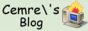

# Home

## About Me
I'm Cemre, a computer engineering graduate with a passion for linguistics and language technology. I founded an e-learning platform, [Lisan](http://lisan.dutl.uk), to help communities preserve their cultural languages. I have experience in Deep Learning and Machine Learning projects in academia and work professionally with a focus on Network Infrastructure and distributed systems. Currently, I'm working on developing networking solutions for Amazon Prime Video to handle millions of transactions with low latency and high availability.

If you're interested in learning more about my past projects, please check out the [projects](projects/projects) tab.

## Hobbies
When I'm not working, I enjoy immersing myself in new languages and cultures. Currently, I'm working on improving my French and Korean. I'm also passionate about photography, both digital and analog. I love being able to capture moments and tell stories through images. Although I haven't been able to pursue this hobby as much as I'd like recently, I'm hoping to make more time for it soon.

## Experience
- Software Development Engineer at Amazon Prime Video (May 2022 - Present)
- Software Engineer at Udemy (Jun 2021 - Mar 2022)
- Undergraduate Researcher at Bogazici University CATLAB (Dec 2020 - Jun 2021)
- Software Engineer Intern at Tazi AI Systems (Jun 2019 - Sep 2019)

## Education
- BSc in Computer Engineering from Bogazici University (Sep 2017 - Feb 2022)
- Exchange student at CentraleSupélec (Jan 2021 - Jun 2021)

## Publications
- FairStyle: Debiasing StyleGAN2 with Style Channel Manipulations (ECCV 2022)

## Languages
- Turkish (Native)
- English (C1)
- Spanish (C1)
- French (C1)

## Buttons
{class='button'}
{class='button'}
[hughcrawford{class='button'}](https://photooftheday.hughcrawford.com/)

[@cemre@mastodon.social](https://mastodon.social/@cemre){rel=me hidden}