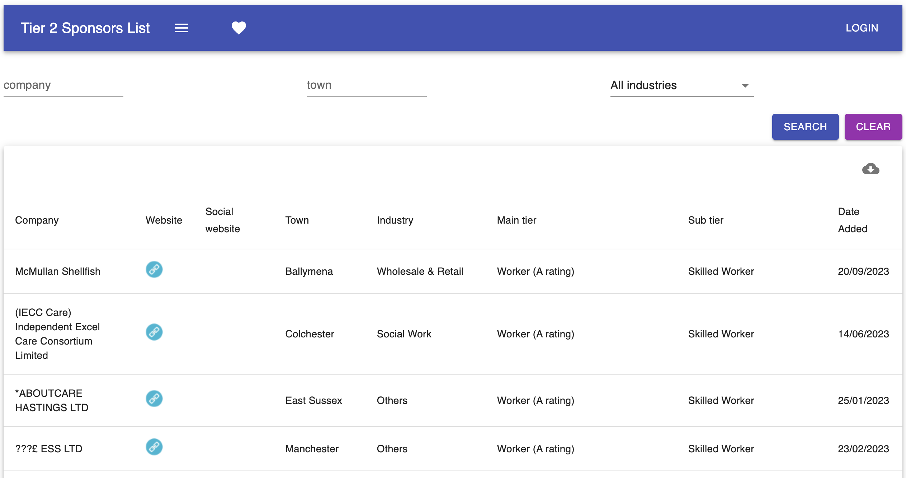
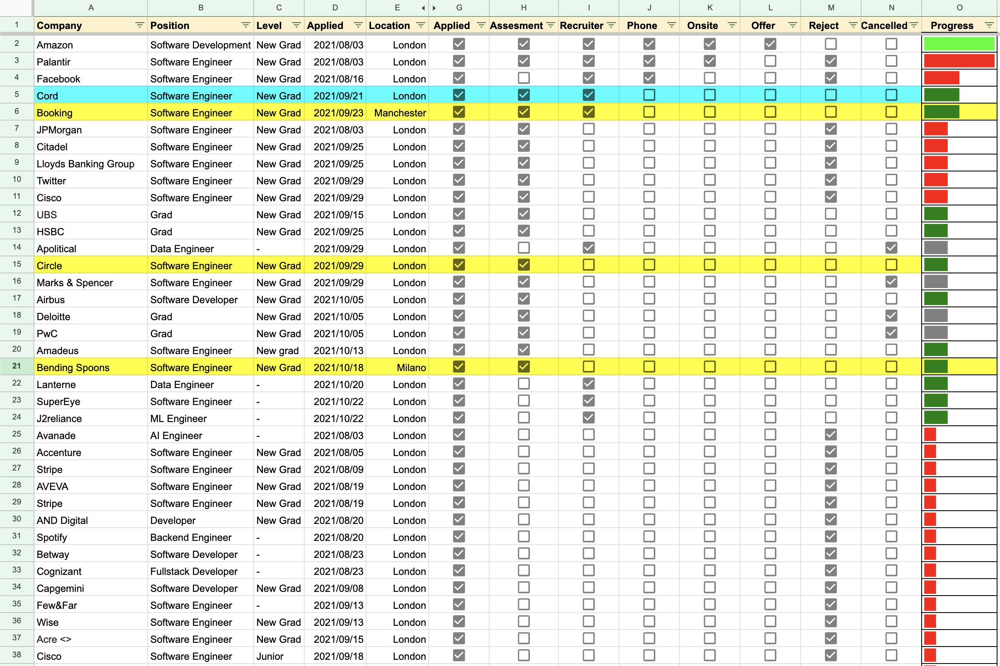
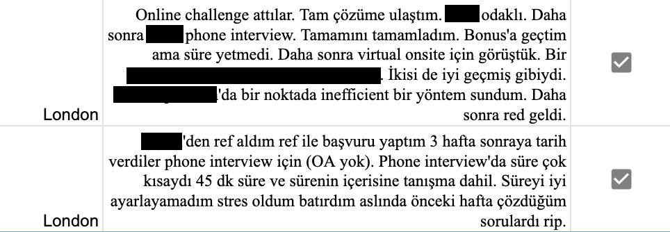
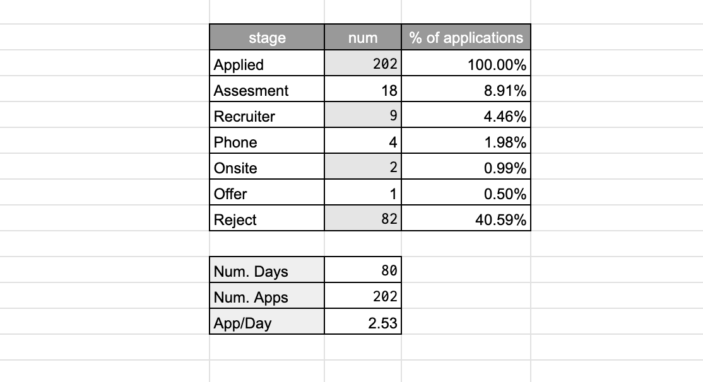
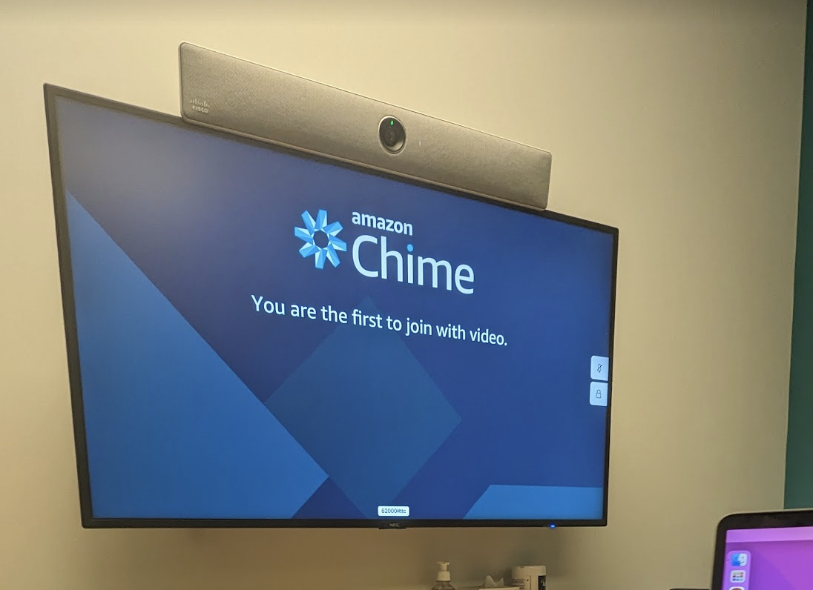

# How to land a Software Engineering job in the UK

! emoji 💂🏼
@ uk, job-hunt, visa

I have been working as a Software Engineer at Amazon Prime Video in London since May 2022. 
Job search in the UK as a Turkish citizen it can be a quite obscure process, and not many people have visibility into the process. 
This document aims to provide context and help to get you started from someone who has been through the process.

[TOC]

## 1. Glossary

- **Visa Sponsorship**: Visa sponsorship is a process where a company in the UK, offers to support a foreign national in obtaining the necessary visa or work permit to legally work there. Visa sponsorship is crucial for individuals who are not citizens or permanent residents of the UK but wish to work there. The sponsoring company typically helps with the visa application, including providing documentation and support, to facilitate the legal employment of the foreign worker. They might also assign you an immigration assistant from an external company throughout the process.
- **Rolling Admission**: Rolling admission or rolling application process, is a hiring strategy used by some companies. Companies continuously accept and review job applications throughout the year, as opposed to following a strict deadline for application submission. This means that job seekers can apply for positions at any time, and companies review and fill positions as qualified candidates are identified. It allows companies to have a more flexible hiring timeline, and candidates may have a better chance of being considered if they apply early in the process.

## 2. Finding a job opening

Recently, the job market hasn't really been the best. Finding job openings can be tiresome and locating job offers that do offer visa sponsorship is not easy as companies do not always include this in their job listings. Let me list what I tried and what I ended up doing.

Before diving into the techniques to find openings, I want to mention that a lot of companies do rolling admission. So timing is critical. The earlier you climb the processes of a companies hiring steps the likelier you are to be hired. 

So make sure to apply as early as you can, have your applications formation readily available on your mobile devices so you can apply on the go.

### 2.1 Linkedin 

**Searches**

Every 2-3 days I would go on LinkedIn to check positions in the UK that may be recommended to me by the LinkedIn algorithm. 

**Alerts**

Additionally I had email alerts active. If you directly create an alert, the LinkedIn UI gives you a not very fine-grained set of choices for your alerts. Instead what you can do is creating alerts for specific searches. I had alarms set up for a bunch of searches for a while before landing my position.

Let's go through search fields one by one:

1. 🟢 **Text Query**: This is the query you search for initially when you begin your LinkedIn search. I had alerts with the query field set to `Software`, `Data Scientist`, `Machine Learning`. This field will depend on your specialisation but it is always wise to have one with `Software` to cover most bases.
2. 🟢 **Date Posted**: Best to keep this in line with your alert's period. i.e. if you have daily alarms, include last 24 hours.
3. 🟢 **Location**: This is a safe field an mostly used well by companies. My searches were almost all confined to United Kingdom. You can have a set of cities, or countries, or economic zones (i.e. European Union).
4. 🔴 **Experience Level**: This is an unsafe field for LinkedIn searches as it is often not respected by companies putting out these job adverts. If you filter to say, `Entry Level`, there is a high probability that you will miss on a lot of opportunities so I suggest not using this field.
5. 🔴 **Salary**: Ditto
6. 🟠 **Company**: This is a field I used for defining different sets of alerts. I had a 24h period alert spanning FAANG-adjacent companies (Facebook, Apple, Amazon, Netflix, Google and the likes of Twitter, JPMorgan, Bloomberg, Yelp, SkyScanner etc.) and a weekly alarm with an unset company field so I could track all openings.
7. 🔴 **On-site/Remote**: I suggest not using this field as it also tends to be subject to erroneous use.
8. 🔴 **Easy Apply**: I marked easy apply as a red field because I haven't really had anyone contact me from the Easy Apply applications I have made. If you do see an Easy Apply opening, I suggest checking out the company's Hiring page on their official website. Only use Easy Apply if they don't have any opening adverts they are hosting themselves.
9. 🔴 **Industry**: I don't suggest filtering based on this field as companies in different industries may offer well-paid and well-established SWE positions. Say the likes of Bloomberg. You may wish to use this if you're targeting specific high-salary industries like Finance.
9. 🔴 **Job title**: I don't suggest filtering based on this field if your alert is not confined. to tech industry companies.
10. 🔴 **Salary**: Again a not well-respected field by hiring managers and is also frequently left blank so do not use this if you don't want to miss out on opportunities.

**Profile**

Goes without saying that you should keep your profile up-to-date. Make sure to add descriptions to your previous and current positions to rank higher in keywords for recruiters. Recruiter mail may feel like spam, but they are people who are trying to get a paycheck by getting someone hired, so follow them and get in touch if you see a potential opening.

### 2.2 Company websites

You must subscribe to job opening alerts by your target companies that are hiring at high volumes. This covers any big tech.

Some examples:

- [Meta careers](https://www.metacareers.com/)
- [Amazon jobs](https://www.amazon.jobs/en/)
- [Google careers](https://www.google.com/about/careers/applications/)

Most companies do have mailing lists you can subscribe to, make sure to do so to not miss out.

### 2.3 How to find companies that offer visa sponsorship

Not all companies offer visa sponsorship. And not all companies that do have the ability to offer visa sponsorship do so in all their positions.

What I have done for applying to non-big-tech companies was using the following website to track visa sponsors:

Link: [UK Tier Sponsors](https://uktiersponsors.co.uk/)

This is a comprehensive list of companies that ar eligible to offer visa sponsorship.

I used this website in two ways:

1. Checking if companies I am applying through LinkedIn adverts are registered here.

2. Going through literally all entries in this web app and opening their websites in new tabs, one page at a time. Then I would go through all websites to see if there are any openings, apply if yes, look for open positions in LinkedIn if not, and would apply to everything I could find. 

P.S. if you're going for the 2nd option, filtering by industry might help reduce your wasted time.

Apparently they have also added a saved list, slack community, and an option to export the list, and most recent additions to the list which could be useful (mental note to myself for hooking this data up to a mailing list) and did not exist at my time using the app.

### 2.4 Sharing is caring

It's good to have alerts and such, but it's even better when the adverts pass through a human filter. If you're a collaborative soul, find or form instant messaging groups, message boards where people share open positions in their company.

## 2. Steps of the hiring process

The hiring process usually has the following steps (steps 2 & 3 may occasionally be swapped):

1. Online Assessment (OA)
2. Phone-Screen Interview
3. Recruiter Call
4. On-site Interview

### 2.1 Online Assessment

Usually the first step of the interviewing process, the OA usually comprises of two coding questions that you can solve at an allocated 45-60 minutes of your choosing.

One should keep in mind that unfortunately, having a 100/100 score on these questions won't guarantee that you will advance to the next step.

### 2.2 Phone-Screen Interview

In this step you solve your questions by demonstrating your thought process to an engineer, walking them through the process.

Reaching this step means you are officially going through the interview process. You have passed a CV-review and have demonstrated skill in solving coding problems. 

This is the first step you meet with an engineer from the company, and get to ask questions. Depending on the company you may get asked soft skills questions. In which case refer to the STAR method.

### 2.3 Recruiter Call

You get a call from the recruiter, where they walk you through next steps. You may sometimes be asked small questions based on your skills for them to delegate you to one of the open positions with the title you've applied for.

### 2.3 On-site Interview

On-site interviews are traditionally done by inviting over the candidate to the office of the position. The candidate's accommodation and travel is reimbursed. There, they go through 3 to 5 interviews back to back. These are usually 45 minute phone screen style interviews with 15 minutes of breaks inbetween (or 55-5). I heard they make you write code on a whiteboard! Personally, I went through online on-sites as I was applying through Covid.

## 3. My Experience with the hiring process

Whilst I was going through the interviewing process, I wanted to keep track of everything and keep some statistics on how it was going. 
For this, I started keeping an excel sheet. I kept the company name, position, level, application date, location, interview steps and a little progress bar for some pizazz.

I also had a notes section that I have kept hidden in the above screenshot because what I have written there breaches the NDA of several companies. Keeping track of what questions are asked, what went well and what could be improved is something you can benefit a lot from.

If you need a little estimate of what it took for me to land my job offer; I applied for 202 separate positions in 80 days. You can see a small summary of how my job hunt went in the numbers below.

## 4. My experience getting hired by Amazon

Interestingly, out of the 202 positions I have applied to, the position I went forward with and received an offer from was the through my first ever application.

I had applied to Amazon and interviewed with them 2 years prior for an internship role. My experience was very positive, but as it goes, I was underprepared and failed the phone screen interview. 

Then as I was looking for a job 2 years later, Amazon was the first company I applied to. I had applied for a non-student position. I managed to progress through the OA, the phone screen interview and the recruiter call and they had me pick a date for the onsite interview. When nobody was confirming the date I picked T minus 2 days, I reached out to everyone I could to find out that the position I had applied for was already filled, and the opening was to be closed.

Disheartened, I explained that as a senior year student I was able to pass through this interview process and that I believed this shows potential and skill. I explained that I would like my process to be counted towards a graduate role. I pushed for this to happen a bit more and tried to add grease to the communication between recruiters and hiring managers by asking for updates as least intrusively as I could but still frequently. 

I was given the green light and was told to wait for a certain recruiter to reach out. A month later when student programs started receiving applications, I had my onsite interview over Amazon Chime and received an offer within 5 days.

The Amazon onsite is three back-to-back interviews for grad roles and 5 back-to-back interviews for non-grad roles. Every interviewer asks one soft skills question followed by a coding question or two. 

I can confidently say that Amazon's onsite was the onsite I found the most meaningful, due to the nature of the questions and how different they felt, from industry-standard leetcode questions. These were real business problems simplified into a 1-hour problem, that didn't feel like neither an Introduction to Algorithms exam or a how-many-windows question.

After I joined the company I went through the interviewing training as early as I could. When Amazon starts hiring, I will get to be on the other side of this process welcoming candidates and trying to give them their best interviewing experience :)

