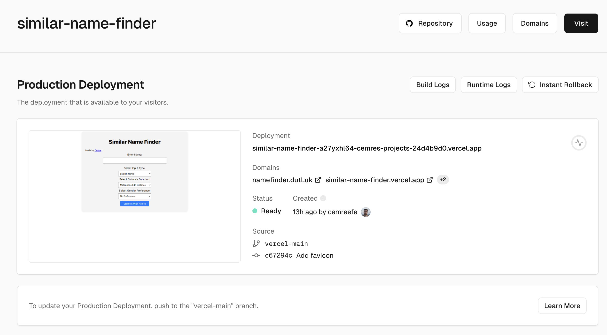
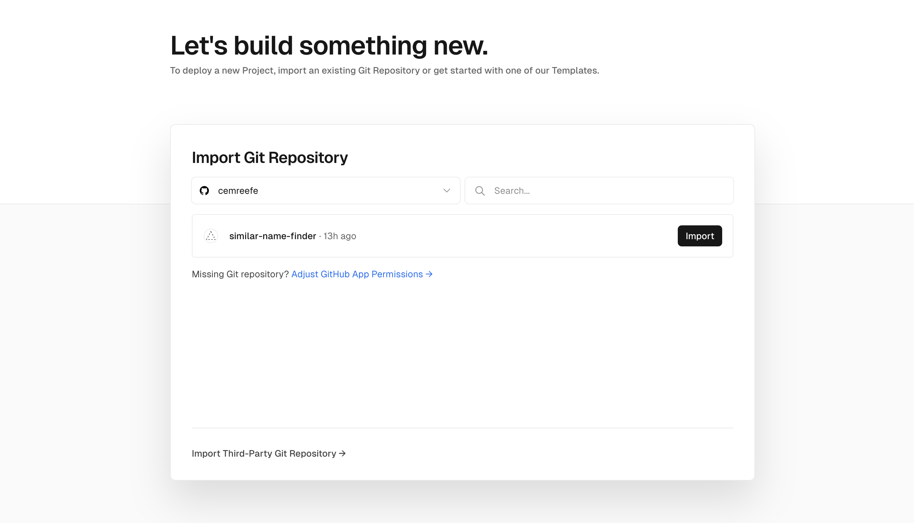
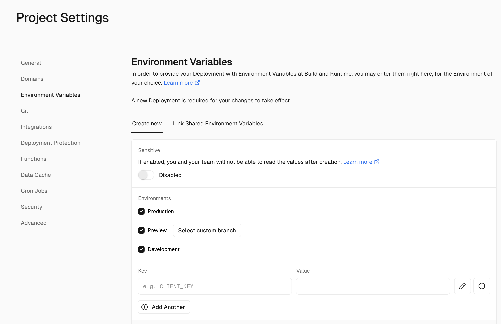

# Host Flask app on Vercel for Free


How to deploy your flask app to Vercel? First a short intro; if you know what vercel is and why you want to deploy your project to vercel, [skip here](#okay-how-do-i-deploy-my-flask-app-to-vercel-then).

## What is Vercel?

Most people know Vercel as a front-end solution, however Vercel introduced many new features recently that make it a powerful tool for running small webapps **for free**.

Vercel is a platform that enables developers to build, deploy, and manage modern web applications. Having tested it myself, I can vouch for the fact that once integrated, it is quite simple to use. With Vercel, developers can simply push their changes to their GitHub repository, and the platform will automatically redeploy the site and update the server with the new code (CI/CD Anyone?). The platform also provides a dashboard for each site, offering insights into status, recent deploys, and domain information. 



Contrary to many other services, custom domains on Vercel can be configured for free. Additional features like insights dashboard, traffic, acquisition etc. are paid features. However, if you're like me, meaning you like developing small web applications that are fine to be constrained by free-tier limitations (see table below), then Vercel is a great solution for you.


|   ▲   | Hobby | Pro | Enterprise |
| ----- | ----- | --- | ---------- |
| Projects | 200 | Unlimited | Unlimited |
| Deployments Created per Day | 100 | 6000 | Custom |
| Serverless Functions Created per Deployment | [Framework-dependent*](https://vercel.com/docs/functions/serverless-functions/runtimes#functions-created-per-deployment) | ∞ | ∞ |
| [Proxied Request Timeout ](https://vercel.com/docs/limits/overview#proxied-request-timeout)(Seconds) | 30 | 30 | 30 |
| Deployments Created from CLI per Week | 2000 | 2000 | Custom |
| [Vercel Projects Connected per Git Repository](https://vercel.com/docs/limits/overview#connecting-a-project-to-a-git-repository) | 3 | 60 | Custom |
| [Routes created per Deployment](https://vercel.com/docs/limits/overview#routes-created-per-deployment) | 1024 | 1024 | Custom |
| [Build Time per Deployment](https://vercel.com/docs/limits/overview#build-time-per-deployment)(Minutes) | 45 | 45 | 45 |
| [Concurrent Builds](https://vercel.com/docs/deployments/concurrent-builds) | 1 | 12 | Custom |
| Disk Size (GB) | 13 | 13 | 13 |
| Cron Jobs | [2*](https://vercel.com/docs/cron-jobs/usage-and-pricing) | 40 | 100 |

For more, read on their blog [# What does Vercel do?](https://vercel.com/blog/what-is-vercel).

## Okay, how do I deploy my flask app to Vercel then?

This is assuming you already have a Flask app up & running in your local. If not, go to [# Vercel: Flask Hello World](https://vercel.com/templates/python/flask-hello-world).

### 1. Directory Structure

Okay, you have your Flask app, and presumably, it looks something like this:

```
--$ git(mainline)--
my-flask-app/
├─ app.py
├─ helpers/
│  ├─ some_helpers.py
│  ├─ other_helpers.py
├─ static/
│  ├─ favicon.ico
│  ├─ styles.css
├─ templates/
│  ├─ index.html
├─ .gitignore
├─ README.md
```

Let's create a new branch from HEAD, and form our new directory mapping for Vercel.

```
--$ git(vercel-mainline)--
my-flask-app/
├─ api/
|  ├─ index.py # renamed from app.py
|  ├─ static/
|  │  ├─ favicon.ico
│  |  ├─ styles.css
|  ├─ templates/
|  │  ├─ index.html
├─ helpers/
│  ├─ some_helpers.py
│  ├─ other_helpers.py
├─ vercel.json
├─ package.json
├─ .gitignore
├─ README.md
```

Where `vercel.json` looks like the following, which dicatates your flask app's path from root.

```
{
  "rewrites": [
    { "source": "/(.*)", "destination": "/api/index" }
  ]
}
```

P.S. Your `index.py` will be able to import packages as if it was at the root in this structure. No code changes required for this directory structure change.

And package.json looks like the following:

```
{
  "engines": {
    "node": "18.x"
  }
}
```


### 2. Create a Vercel account and connect your repositoy

Create a Vercel account, go to Projects > Import and connect your Vercel account to your github account to get access to your public or private repositories. Choose the repository of your flask app, choose `vercel-mainline` as the target branch and import your project.



After importing your project, vercel will attempt your initial deployment. At this point, the deployment should succeed given your repository is in the correct organizational structure introduced in (1). Congratulations, your app is up & running at `<app-name>.vercel.app`.

### 3. Environment variables

Vercel lets you define an arbitrary number of environment variables. What I like to do is running my apps on my local in debug mode. So I add the following if-else block into my main definition, and define a VERCEL environment variable.

```
if __name__ == '__main__':
    if os.environ.get('VERCEL', None):
        app.run(debug=False)
    else:
        app.run(debug=True)
```



## Conclusion

This is how to get your already existing flask app running on Vercel in no time. If you have any comments, recommendations or trouble following the steps here. Please feel free to reach out 👇

! include socials

! include other-articles
