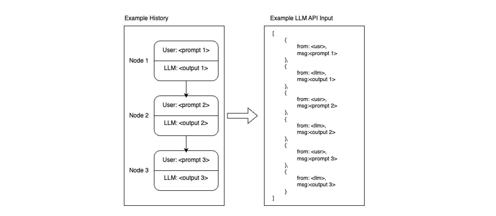
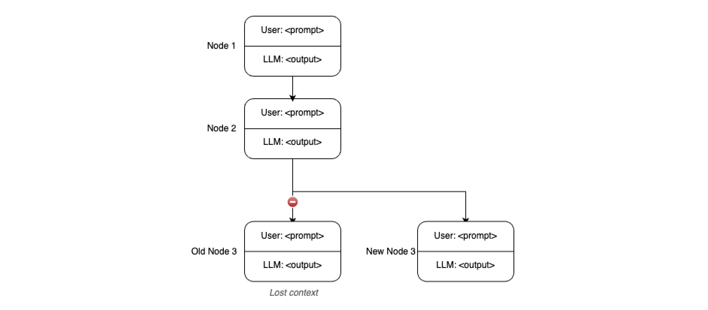
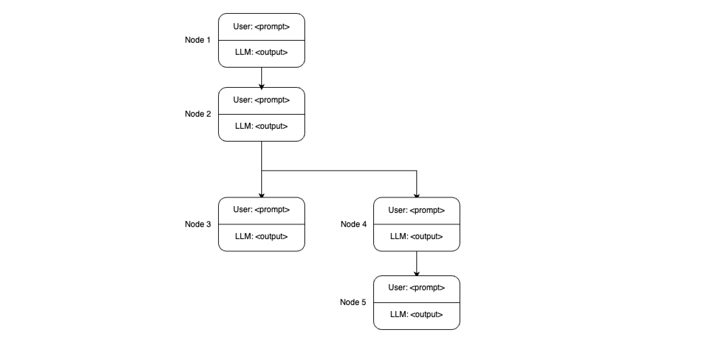
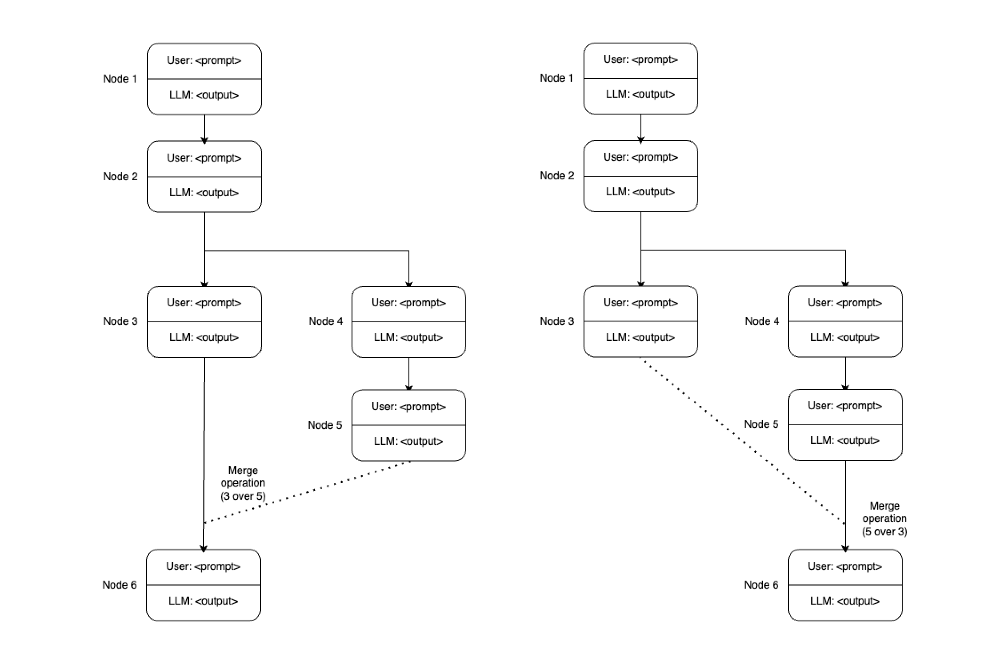
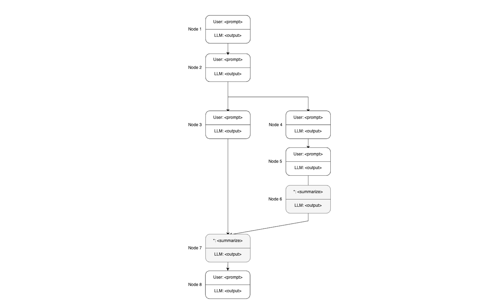

# Managing LLM Conversations Using a Graph Structure

## Introduction

Nowadays the mainstream method of managing our conversations with LLMs is a **linear chat structure** where, every question-answer pair is followed by another.
If we would like to refer to a previous answer with its full context, we often feel the need to redact everything after that point to continue our conversation from a particular point in the discussion, **losing our access to the other branch** (_à la_ github copilot) or we have **isolated branches** where we can continue our conversation, where we need to switch views (_à la_ ChatGPT). 

Either way, **we lose the ability to branch out and then recollect our conversation** as is the case with most naturally ocurring human dialogue where parties may get **sidelined** for a while **and get back to the topic** at hand.

To overcome this, I am making a **simple proposal of graph-managed LLM conversations**, where we make use if different branches to explore different parts of our conversation and then can **merge contexts** into one to continue our conversation with the full picture.

## Setting the glossary

### The conversation node

In a contemporary human-LLM conversation, the most basic building block of a dialogue is a **question-answer (or input-output) pair**. For simplicity, we will call this a conversation node. 

A conversation node can be defined as an input-output pair in the human-llm conversation.

### Conversation history

A **sequence of conversation nodes** form a conversation history. A conversation history can be authentic (formed by consecutive pairs of real input-output) or fabricated, meaning the data is synthetic and the conversation has not taken place as is represented.

### Transforming Conversation History into API Input
The sequence of conversation nodes are generally dumped into a json file to feed an LLM API with, this, as is the case with the conversation history, is **open to manipulation**.

### Branching Conversations
When we branch off from an earlier node, we may lose context from the existing branch when talking to the LLM agent. Which is expected.

However the conversation may pick up pace in the new branch to explore some unfamiliar concept. Eventually, the user is going to want to return to the "main" conversation, which has its context isolated from the current conversational branch.

## Proposal 

### Merging Priorities

When we have two or more branches in a conversation, we may want to merge them back into a single conversation. However, one important aspect to consider is the order in which these branches are merged. The order of merging can affect the context that the LLM has when generating responses. 

Tthe user should have the ability to specify the order of merging, effectively setting the priority of each branch. At this point, we can fabricate a new conversation history where the branch of an unprioritized context can precede the prioritized one.

### Background Summarization and Prompt Compression

During the merging of the branches, the LLM will have a lot of context to consider when generating responses, depending on the length of every individual branch, the unprioritized context can fall far behind. To help the LLM manage this context effectively and increase recall, we can use techniques such as background summarization to rebase deprioritized branch closer to the prioritized branch and/or try prompt compression to achieve the same.

One such method for prompt compression is the LLMLingua (add reference here), which provides a structured approach to managing and compressing LLM prompts.

### Conclusion
As a concept, graph-managed LLM conversations can enable us to hold broader discussions with specific sides of a topic and then return to the main topic with the complete context of all discussions which is a very powerful function of human-to-human conversation. This approach will greatly improve the context-awareness of your LLM agent and should give you a means of having all-round discussions with it with more precision and depth.
