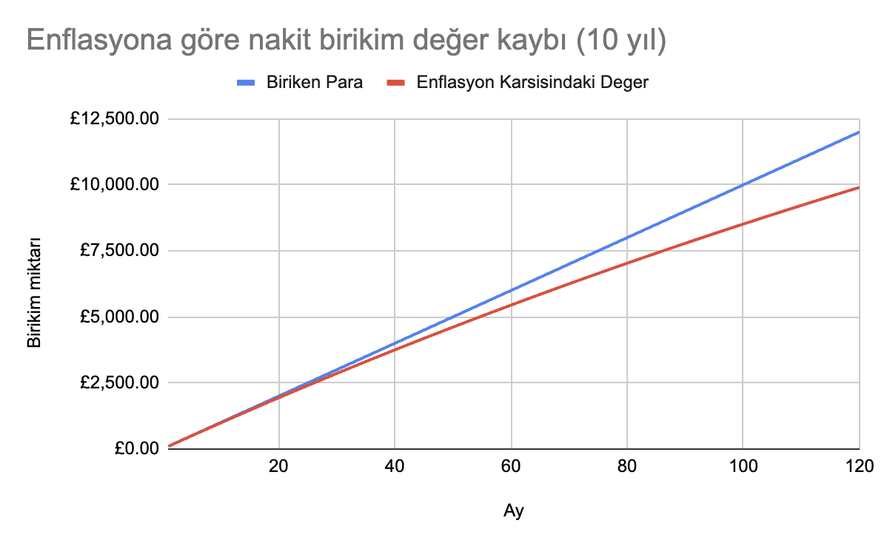

<parsers-ignore>

</parsers-ignore>

# Tax-free investment in the UK: What is an ISA?

In this article, I will explain what ISAs are, why they are profitable, and how to open them for those residing in the UK looking for easy and tax-free investment opportunities.

[TOC]

## Why should you invest?

Growing up in Turkey, the common forms of investment around me were: saving money in the bank, buying gold, and buying foreign currency. I also bought foreign currency with all the money I saved because if the money was kept in TL (Turkish Lira), it would lose value due to inflation, while foreign currency always increased in value compared to TL (interest rates were around 14%).

When I started living in the UK, the money you earn is already in foreign currency, so it becomes clear again that money loses value if it just sits there. There is inflation in sterling as well as in dollars. Especially if you are trying to save. (Gold is a different topic).

Even if we disregard the crisis period of 2022-23, inflation in the UK is around 4% these days. A simple calculation shows that if you save £100 from your salary every year for 10 years:

You can see that the value of the money you save loses ~10% of its value after 5 years and almost ~20% after 10 years.

| **Year** | **Month** | **Saved Money** | **Value Against Inflation** | **Percentage Lost to Inflation** |
|----------|-----------|-----------------|-----------------------------|----------------------------------|
| 0        | 1         | £100            | £100                        | 0.00%                            |
| 0        | 2         | £200            | £199.67                     | 0.17%                            |
| 1        | 12        | £1,200          | £1,178.24                   | 1.81%                            |
| 2        | 24        | £2,400          | £2,310.21                   | 3.74%                            |
| 3        | 36        | £3,600          | £3,397.72                   | 5.62%                            |
| 4        | 48        | £4,800          | £4,442.52                   | 7.45%                            |
| 5        | 60        | £6,000          | £5,446.28                   | 9.23%                            |
| 10       | 120       | £12,000         | £9,903.83                   | 17.47%                           |

[full table](https://docs.google.com/spreadsheets/d/1m7qbAlTDD7CuxjMsYBVIIGdn7fneR_Hbj3ccn3QwnXo/edit?usp=sharing)

{style="max-width:80%"}

The lesson to be learned here: We need to beat inflation. But how? By investing in assets that do not lose value due to inflation. By definition, inflation means the devaluation of money. In times of high inflation, the primary (and sometimes the only) asset that loses value is money. For example, real estate prices do not succumb to inflation. Similarly, the real value of companies does not decrease (solely due to inflation). So, we need to direct our investments towards real estate or companies. We don't have the money to buy real estate, but fortunately, we don't need to buy whole companies. This is where stocks come into play.

The advantage of the stock market is that you can enter without having hundreds of thousands of pounds like you would need for a house or land. If you don't have the money to buy larger assets and don't want your money to lose value until you can afford them, the stock market is a good option.

## What is an ISA?

An ISA (Individual Savings Account) is a type of account in the UK that allows individuals to save and invest with tax advantages. You can hold **cash** or buy **stocks** in your ISA accounts. The advantage of ISAs over other accounts is that any gains made up to £20,000 per year are not taxed.

## How much tax advantage can I get with an ISA?

Under normal circumstances, if you buy $100 worth of $AMZN (Amazon shares) in the UK and the value of this share rises to £110 by the end of the tax year, you would need to pay capital gains tax on the £10 gain. Your capital gains tax rate will vary depending on your total income tax bracket:

| Gain Range               | Tax Rate   |
|--------------------------|------------|
| Up to 12,500 GBP         | %0         |
| 12,501 - 50,000 GBP      | %20 (basic)|
| 50,001 - 150,000 GBP     | %40 (higher)|
| Over 150,000 GBP         | %45 (higher)|

If your tax bracket is higher, you pay 20% tax on the increase in the value of your shares from the chargeable asset category. If it is basic, it is more complicated (and higher). You can see the step-by-step calculation [here](https://www.gov.uk/capital-gains-tax/rates#if-you-pay-basic-rate-income-tax).

This means that if your annual gross income is £51,000, you will pay 20% of your stock gains to HM Revenue and Customs.

On the other hand, ISA accounts offer a significant advantage by not taxing gains. When you put up to £20,000 a year into an ISA account, you can play the stock market as you wish without paying any tax on the gains.

## Who can open an ISA?

To open an ISA, you need to reside in the UK. Additionally, US citizens cannot benefit from ISAs.

## Is an ISA safe?

The money you invest in ISAs (principal) is protected under the FSCS, so if your ISA bank goes bankrupt, the government must repay your principal up to £85,000 per bank. For details, you can visit https://www.fscs.org.uk/.

## What are the types of ISAs?

There are four main types of ISAs:

- **Cash ISA**: A cash-based savings account. It pays interest on your money, and you do not pay income tax on the interest.
- **Stocks and Shares ISA**: An account type that includes various investment instruments such as stocks and funds. Gains and dividends are not subject to tax. These accounts generally pay interest on the cash you deposit, like a CISA.
- **Lifetime ISA (LISA)**: Designed for individuals aged 18-40. It encourages saving for a home purchase and retirement. The government adds a 25% bonus to the amount you save (you can save up to £4,000 per year). This way, you can get £1,000 in government support every year with a LISA. However, to withdraw money from a LISA, you must either (1) reach the age of 60 or (2) use the money to buy a home valued at less than £450,000.
- **Innovative Finance ISA**: Allows investment in peer-to-peer lending platforms. The interest earned here is also tax-free. Personally, I would avoid it.

The editor's preference here is the **Stocks and Shares ISA**. You can both earn interest on your money and keep it in funds resistant to inflation to earn gains.

Update - 2024: From this year on, it is now free to open multiple ISAs in the same year. Also, the LISA house price limit has been increased to £450,000. If you are considering buying a cheap 1+1 in London or a house outside London, you can open an S&S ISA and a LISA, deposit your first £4,000 into the LISA and the rest into the S&S ISA. When you are ready to buy a house, you can withdraw the money in the LISA along with the annual £1,000 government bonus. Considering that it is unlikely for your investments to increase by 25% annually, this is a good way to maximize your profit.

## ISA providers

If you have an account with any High St. bank in the UK, your bank is likely to offer ISA management services. However, bank ISAs are generally cumbersome and difficult to use.

While there are [numerous](https://www.gov.uk/government/publications/list-of-individual-savings-account-isa-managers-approved-by-hmrc/registered-individual-savings-account-isa-managers) ISA providers on the market, I will talk about the more popular ISA providers that my friends and I have experience with:

- Vanguard
- Freetrade
- Trading212

### Vanguard

Vanguard is one of the oldest and most established ISA providers.
- Pros: Wide range of funds, low investment costs.
- Cons: No mobile app, you need to log into the website for manual purchases and tracking your shares. Charges management fees on the funds you hold.

### Freetrade 

Freetrade offers a more modern and user-friendly interface.
- Pros: No commission on sales and purchases.
- Cons: £5 monthly membership fee.

### Trading 212

Another modern interface application.
- Pros: Has some funds that Freetrade does not, but unlike Freetrade, it has no monthly membership fee. Simplifies automatic investing and portfolio creation with the **Pie** concept. Pays double the interest on cash compared to Vanguard (5.6%).
- Cons: May initially seem a bit complex to use compared to Freetrade.

Editor's choice: **Trading 212**. It offers commission-free trading, narrower currency spreads compared to Freetrade (0.45% vs 0.15%), no monthly extra fee, and higher interest on cash. After using Freetrade for a year, I opened a Trading212 account this year and am quite satisfied so far.

## Free shares with ISA providers' referral systems

Since there are so many ISA providers in the market, most of them try to attract new users with referral systems. When you sign up with a referral from an existing user, both the referrer and the referee receive a free share. **Freetrade** gives a random share worth between **£10 and £100** to new users. **Trading212** gives a fraction of a share worth **£12**.

## Things to know before opening an ISA account

1. You must deposit up to £20,000 of principal into your ISA account in a tax year. If you exceed this amount, your gains will be taxed.
2. <s>You can open an account with one ISA provider per tax year (April - April).</s> This requirement has been lifted from the 2024-25 tax year. You can open accounts with as many ISA providers as you want. However, the total principal you deposit each tax year must not exceed £20,000.

## How can I open an ISA account?

You can open your ISA account in as little as 15 minutes. It is good to have a type of photo ID handy when signing up with ISA providers, as you will need to take a front and back photo of your photo ID and a selfie showing your face to verify your identity. Depending on which ISA provider you decide to open an account with, you can download their app and start your membership process.

If you've read this far and want to benefit from the free share system with referrals, it would be greatly appreciated if you sign up using my referral links.

### [Trading 212 referral link](https://www.trading212.com/invite/19BZWthpGq)
### [Freetrade referral link](https://magic.freetrade.io/join/cemre-efe/552eee0e)

In another article, I will talk about which funds and shares I invest in and how. If you want to stay updated, just send an email with the subject `+` to cemre@duck.com.

Thanks for reading and happy saving.

! include socials
! include other-articles
