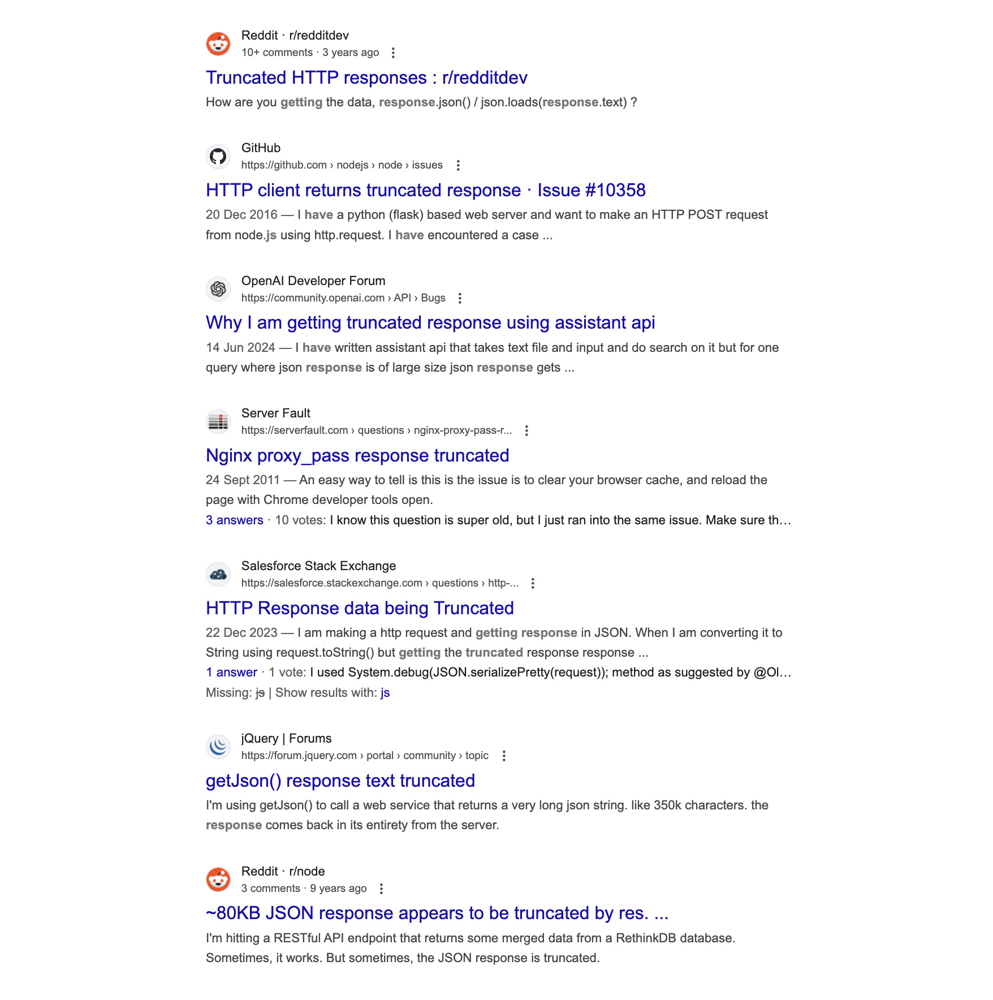

# Writing a Client-Side RSS Reader

[TOC]

A few months ago, after getting frustrated with a few popular RSS readers online, I decided
I could create my own RSS reader (as you do).

My main points of frustration were, these tools were either completely paywalled, or had free tiers
and would beg you to get the premium at every chance, or had free tiers that are a pain to operate.

I wanted something that would just get the job done, as in show me posts from feeds I follow. Give me
a clean UI to go through them, would be completely free to run and use. And not have any unnecessary
distractions.

A couple weeks later, someone asked if anyone knew of a good RSS reader in a whatsapp group I was part
of. And I thought I could come up with something really quickly.

I ended up creating <https://rss-reader.dutl.uk>.


Its pretty straightforward. You just enter a list of RSS feeds into the feeds section. The tool fetches
all feeds in parallel. As these feeds are fetched, their content is parsed and used to create items on 
your reader feed. And bob's your uncle!

If you don't know what RSS is, keep reading. If you already know, skip to [Challenges](#challenges).

## What is RSS anyways

RSS (short for Really Simple Syndication) is a syndication that defines a clear format for 
creating feeds from shared content. 

An RSS reader can feed from a number of RSS feeds, creating a single place where a user can
follow their favourite blogs, websites, magazines, news publishers, and so on, given that
the content creator chose to curate an RSS feed for their publications.

An RSS feed looks like this: (see for yourself on <https://cemrekarakas.com/rss.xml>). 


If you're as young as myself, you might not remember RSS at all, but it used to be all the rage.
When the internet did not consist of _gated gardens_ and the social aspect of the web was open,
People were using RSS feeds to stay up to date with friends and influential people.

RSS was supported by likes of twitter, every blogging platform out there, as well as 
news sites.


<small>https://devcommunity.x.com/t/can-you-get-your-twitter-feed-in-an-rss-feed/10178</small>

As social media emerged and walled off the internet from each other and the social aspect of the
internet moved away from public blogs, RSS descreased in popularity. Twitter removed native support,
Google shut down their free RSS reader.


### So,,, its dead?

Not at all! RSS has been making a comeback as more on more creators move off social media, especially
after the recent turmoils in the billionaire space. Twitter is losing support over Elon Musk's acquisition
and his co-temporal plummet in popularity, his co-presidency with Donald Trump and many other Elon Musk
shanenigans. Meta is losing support in the younger generation and tiktok is gaining popularity.

Everything points to short-form video. So what happens to text? As social media is being dominated by short-form
video, and every possible form of publication converges to this medium much like carcinization [], the winds of
change create a new vacuum in the content creation space, where long form text lingered. Nobody is really capitalizing
on this side of the web, aside from maybe substack. Enter --

### Blogosphere and the federated web

Akin to the old web some communities have started embracing tenets from web 1.0, forming blog chains (not to be confused
with blockchains!). Blogs tend to have an RSS feed to promote content, and make it more easily accessible. 

The federated web (mastodon and the likes) use another form of syndication (if you could call Activity Pub that), but that
means the federated web, or the _fediverse_ is not gated off from the rest of the web. And a lot of good work has been
going towards bridging the web back together. There are two-way converters between ActivityPub and RSS, where people
can mirror RSS feeds in a mastodon instance or, as most mastodon instances support, they can directly get an RSS feed from
a federated publisher's feed. See <https://mastodon.social/@Gargron.rss>

## Challenges

### Saving user state

There is no backend, so there is no place we can store user data to take relevant decisions. I made an intentional
decision of not using a server, so I needed to provide the user a way to save their feed. 

My preferred solution to this problem was to save everything user-state-wise in the url parameters. In this way, if
the user bookmarks their feed, they will always be able to reach it.

See for yourself, take a look at this hideous url: <https://rss-reader.dutl.uk/?feeds=https%3A%2F%2Ffeeds.simplecast.com%2F54nAGcIl%2Chttps%3A%2F%2Fwww.nasa.gov%2Ffeeds%2Fiotd-feed%2F&ttl=30&blocklist=&truncLim=100>

#### Caveats

Every time the user adds or removes a feed, they'll have to update their bookmark. So they'll probably have to create a 
new bookmark, and then remove the previous one.

Not ideal, but I found this to be manageable. I added a small script to the web page I curate a list of RSS feeds in,
that will parse everything and create a link to the rss-reader. I added a redirect script on the page, so that I have a
single bookmark, and feeds get added as I change my list of followed rss feeds. I'll try to make another post about my setup
in the future.

### CORS

There is no backend, so the frontend javascript needs to be able to fetch the feeds. This is not always possible as
most websites have CORS protection. I took the beaten path and used a free proxy server to bypass cors.

I tried a couple proxy servers before deciding on allorigins. The others had way too tight rate limitations to 
provide a reliable user experience. Allorigins on the other hand is moderately reliable. As long as I don't abuse the refresh
button, I get all my feeds 100% of the time, 90% of the time.

Take a look at <https://allorigins.win/>, it's amazing work!

### Huuuuuge feeds (⭐️)

After using this reader for a few months, I realized one of the feeds I added would never be fetched.

As we are using a proxy server to fetch our feeds, the connection is usually slow. We are talking 20KBps slow, for each
connection. This means an average feed 100KB in size would take 5 seconds to fetch. Which is not a big problem!

However! There are blogs with much bigger feeds than that. Taylor.town has a feed that larger than 12 megabytes. It would,
either take a _VERY_ long time to fetch the feed, or the connection would timeout before the request can be completed.
Magazines have even larger feeds. _The Daily_'s feed breaks my browser if I try to open it (which is not an indication of
much, if I'm being honest).

As I was using the developer console on my browser, I realized the data was being streamed. I could see the incomplete feed 
in the response tab of the request on the Networking console.

I had an idea that could work, assuming most RSS feeds do have dates sorted in descending fashion, most of the time I would 
not need the whole 12MB of feed, I could probably just do with the initial 100KBs. 

#### Hypothesis

If we could access the response stream, and abort the request after the response exceeds 100KBs, we could do some XML regex 
magic to remove the last incomplete feed item, and then gracefully close off all XML tags to create a truncated feed that would
only have the latest posts from the feed.

#### Research

Ever tried having _less_ than what an API offers? Probably not. I've searched the web to no avail. Nobody wants a truncated 
response. In fact, many people _are_ getting a truncated response, and they don't want to. Meaning I could not find any blog
entry, stackoverflow question or code sample where someone needed just the first N bytes of a response.



Even trusty ChatGPT was telling me this problem was unsolveable and any library would remove the response upon aborting the 
request itself. But surely, if the browser has access to this data, the JS env thats calling the endpoint must too.

I decided the most promising solutions were ones using streams and decided to focus on streams in axios. I couldn't make axios
work with an aborted request and an incomplete response. I then pivoted to good old fetch.

#### The solution

I ended up with the following javscript code snippet to read the response with a stream, decode it and concatenate it into a 
data object. I'm checking the number of bytes received at every step and I'm returning early if the stream's total received bytes
exceed my pre-defined limit.

``` js
    // Make the request using Fetch API (which supports streams)
    fetch(url, { signal: controller.signal })
      .then((response) => {
        const reader = response.body.getReader(); // Read the stream of data
        let receivedBytes = 0;
        // Read the stream in chunks
        const readStream = () => {
          reader.read().then(({ done, value }) => {
            if (done) {
              // Stream finished, resolve with the accumulated data
              resolve({
                data: accumulatedData, // Return the accumulated XML data as string
                status: response.status,
                statusText: response.statusText,
                truncated: false
              });
              return;
            }
            // Convert the chunk to a string and accumulate it
            accumulatedData += decoder.decode(value, { stream: true });
            receivedBytes += value.length;
            if (receivedBytes >= maxResponseSizeKB * 1000) {
              // We've received maxResponseSizeKB*1000 bytes, abort the request
              controller.abort();
              resolve({
                data: accumulatedData, // Return the accumulated XML data
                status: response.status,
                statusText: response.statusText,
                truncated: true
              });
            } else {
              // Continue reading if we haven't yet received the desired amount of data
              readStream();
            }
          }).catch(reject);
        };
        // Start reading the stream
        readStream();
      })
      .catch((error) => {
        if (error.name === 'AbortError') {
          console.log('Request aborted');
        }
        reject(error);
      });
  });
}
```

I'm not going to lie, with lots of trial and error it took me a couple hours to get this working. But the results
were great! This gave me an RSS feed thats truncated abruptly at the _100 and something_-th kilobyte.

Then I put my computer-science degree to work, and created a generic XML close-off-er (?) that would use a stack to track
all unclosed tags. 

I experimented a bit with keeping the last incomplete item, with an indicator that the post is truncated
at the end. I made me came to realize how shabby XML and HMTL syntax is.


Self-closing tags that are in the format i.e. `<something/>` ?

Self-contained tags that are just straight out tailless, i.e. `` ??

Header tags that don't need a related counterpart and convey information i.e. `<!something>` or `<?something>` ???

I don't even want to know the rest or what they are for at this point.

As having an incomplete post proved to be a bit more non-trivial than just removing the last imcomplete item at the end of the
truncated feed, which is what I ended up doing. This removes the need to handle unclosed HTML tags and allows me to focus on
only closing off the XML tags.

Once I got the closing-off working, everything fit together like a charm, and I was able to quickly get the latest items from all feeds
without exhausting my connection.


<small>Requests made from the reader with limit set to 50KB</small> 

The response size indicators seem to be wrong here ^, but everything works like a charm and requests finish in under 5 seconds. The
speed gains from this is immense! So happy with how it turned out.

### Unreliable CORS proxies

CORS proxies are great, they make client-side hacky apps possible like RSS-reader. They deserve praise, but they are also not too reliable.
80 to 90% of requests succeed, meaning 10 to 20% fail. Which pushed me to create a small list of CORS proxies. On failure I move to the next
one to retry. My current code round-robins through three of them. The code is as follows;

``` js
   // Go over all proxies until a usable response is received.
   const proxies = [
     "https://api.allorigins.win/raw?url=",
     "https://corsproxy.io/?url=",
     "https://test.cors.workers.dev/?",
     "", // Oh hey, what if they _do_ allow CORS?
   ]
   let response = null;
   for (let i = 0; i < proxies.length; i++) {
     let proxy = proxies[i];
     const feedProxyUrl = `${proxy}${encodeURIComponent(url)}`;
     try {
       response = await fetchWithPartialResponse(feedProxyUrl, this.responseTruncationLimitKB);
       if (!!response && response.status == "200") {
         console.log(`Succeeded with proxy ${i} (${proxy}): ${url}`)
         break
       };
     }
     catch {}; // No-op, continue.
   } 
```

This increased my overall success rate from 80%ish to only the occasional odd failure.

## Next steps

### Stream to feed

Aborting the requests early is cool and all, but what if we could go the extra step and _not_ abort the request, just stream the response
into our feed and let our feed grow in size over time? That sounds like the correct user-centric way of going about it. This way we'll be 
able to show the end-user the maximum amount of posts we are able to fetch. 

### _Read_ marks

When I shared this project online, the primary feedback I got was that it would be a very strong tool, if only the users were able to
mark items as _read_.

This comes with its own challenge, the app being serverless, there are only one way I can think about this currently;

**Local storage**

We can keep the read marks in the local storage, meaning the user would see items they marked as read if they use another browser or
they clean their cookies.

We can make this less-annoying by giving them an option to "Mark all previous posts as read". So they won't start from ground zero every time
they change devices. This is still a thought-in-progress.

### OPML exports/imports

Apparently people use OPML to manage their RSS feeds, I guess it onnly makes sense if you have too many of them! The tool will have to support
importing feeds from an OPML file to be considered usable by hardcore RSS enthusiasts.

Edit from 2025-01-10: This is now complete. See


## Ending comments

Thanks for reading so far, if you did. Let me know if you have any feedback with the tool, and feel free to contribute on [github](https://github.com/cemreefe/client-side-rss-reader).

Any ideas overcoming the remaining challenges mentioned are welcome!

! include socials

! include other-articles
