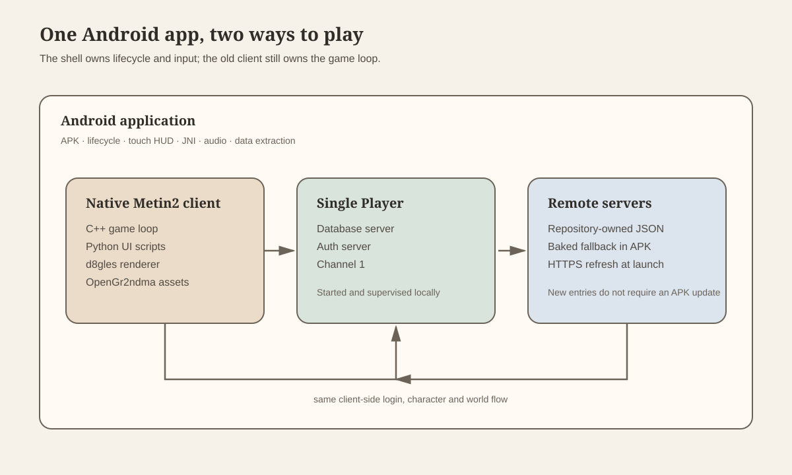
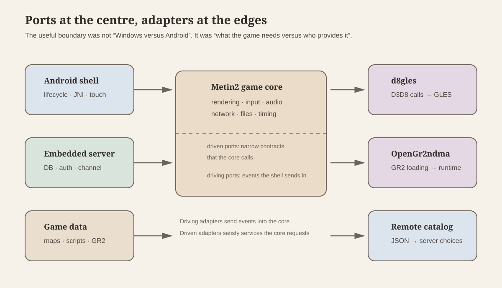
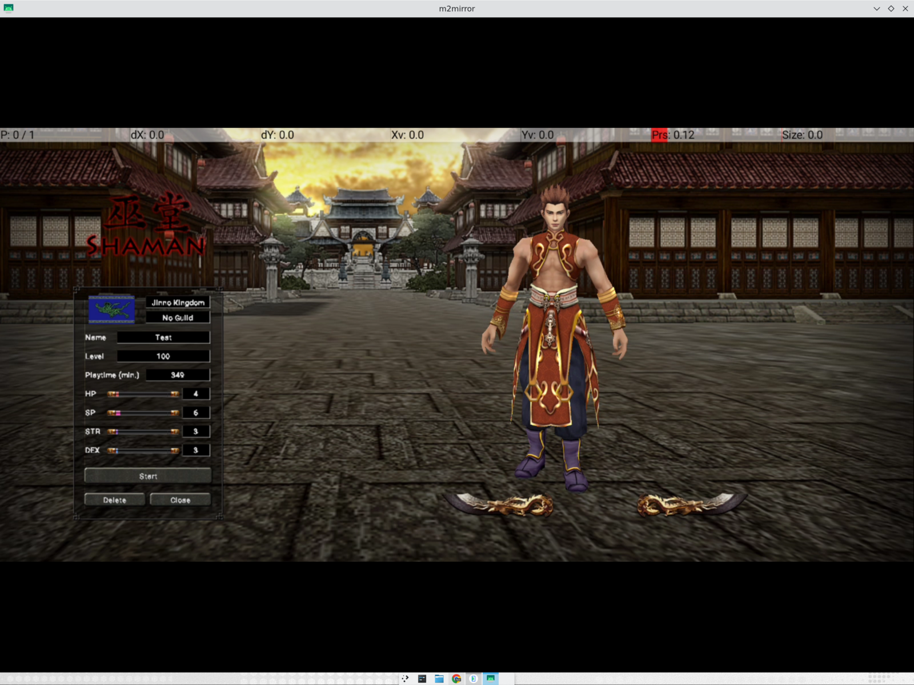
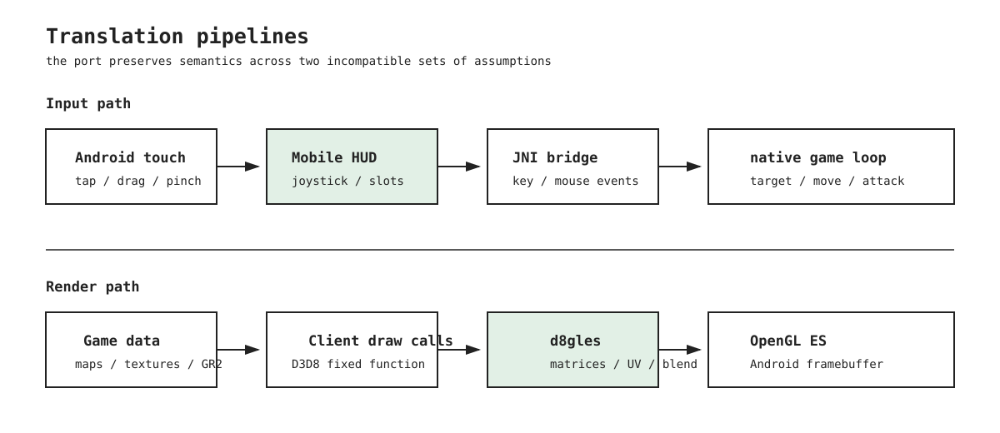
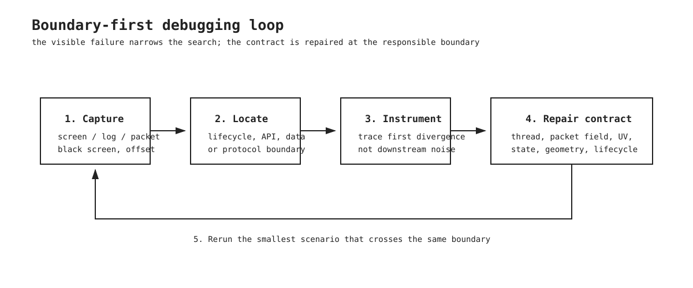

# Porting Metin2 to Android


I have been a fan of game-porting projects for a long time. The idea that a game can be tied to one operating system, one graphics API and one generation of hardware, and that we can plug a translator into all integration ends to make it work in a platform it was never meant for felt very interesting to me. Windows machines haven't been a part of my life for almost 10 years now. If the game is still fun, why should it stop working just because the original platform moved on? With some nostalgia and some technical curiosity I took on the challenge. 

P.S.: I used _a lot_ of AI to get this working.

So I picked a game I spent far too much time with in the 2000s: **Metin2**. 

Metin2 is a Korean free-to-play MMORPG that became particularly popular across Eastern Europe and the Middle East. For anyone out of the loop this game was **HUGE** in Turkey. People got stabbed over it!

It is also a fairly hostile target for a modern Android port. The client was written for Windows, expects Direct3D 8, uses old Win32 APIs throughout, depends on a proprietary 3D asset format, and talks to a server using a very specific binary protocol.

The short version is that it now boots, logs in, enters the world, renders characters and monsters, moves by touch, fights, opens its inventory and persists items. Everything that I could test, works. 

I made a deliberate choice to create a single-player mode too. I ship the server client with the APK so that both the server and client can be run completely locally. No internet required to play! Alongisde that I ship a server list, the game fetches that from github dynamically at startup so I can add more servers to play.



The shape of the finished application is easier to understand as a set of boundaries than as a list of features. The Android shell, native client, local services and remote catalog each solve a different part of the problem.

## The starting point

I did not begin with a clean game engine or a modern source release. I found [Bahori35's unfinished Android port](https://github.com/Bahori35/metin2-android), which had several valuable pieces already in place:

1. A large portion of the Metin2 client source.
2. An Android Gradle and CMake project.
3. A Java Native Interface (JNI) bridge between Android and the C++ engine.
4. The beginning of a Direct3D 8 to OpenGL ES compatibility layer.

It had the right shape, but it was not close to being a playable game. The repository did not contain the proprietary game data, and the compatibility layer was mostly a collection of placeholders. The first attempt to compile the client produced roughly two thousand errors.

That was actually useful. The errors became a map of the assumptions the original Windows build was making.

## Making a Windows client compile on Android

The first phase was not glamorous porting. It was building enough of a Windows-shaped world for the client to stop falling over.

The game calls Windows functions for file access, paths, sockets, timers, threads, fonts, window state and event handling. Android has equivalents for many of these things, but not equivalents with the same names, calling conventions or semantics.

I added a small platform layer that implements the subset the client really uses:

- Windows-style paths and file operations over Android's extracted data directory.
- Socket and connection helpers over the platform networking APIs.
- Timing and thread primitives.
- Window and surface lifecycle hooks.
- Font and text-loading fallbacks.
- The JNI entry points used by the Android shell.

### Example: one `CreateFile` call across three file-system models

The client opens files constantly: map indexes, textures, models, UI scripts and configuration all come through the same `EterBase` file wrapper. The wrapper was written for Win32, so the call site still asks for a Windows file handle:

```cpp
// Open an existing asset for reading, or create the file for writing.
m_hFile = CreateFile(filename,
    dwMode,
    dwShareMode,
    NULL,
    mode == FILEMODE_READ ? OPEN_EXISTING : OPEN_ALWAYS,
    FILE_ATTRIBUTE_NORMAL,
    NULL);

if (m_hFile != (HANDLE)-1)
{
    // The rest of the wrapper uses the handle for reads and seeks.
    m_dwSize = GetFileSize(m_hFile, NULL);
    m_mode = mode;
    return true;
}
```

<small>[clientsource/EterBase/FileBase.cpp](https://github.com/cemreefe/metin2-android/blob/main/r10dev.net%20OPENGL-ITJA/clientsource/EterBase/FileBase.cpp#L106-L130)</small>

On Windows, `CreateFile` returns a kernel `HANDLE`. The wrapper then uses that handle to get the asset size, read bytes, seek through packed data and close the file. This is why preserving the call's handle and error semantics mattered: changing only the open call would still break every later operation.

Android's native file primitive is a POSIX file descriptor, and the packaged data is extracted into an app-owned directory. The bridge keeps the old names at the client boundary and maps the operations underneath:

```cpp
// Translate Win32 access and creation flags to POSIX open flags.
HANDLE CreateFileA(LPCSTR name, DWORD access, DWORD, LPSECURITY_ATTRIBUTES,
                   DWORD disposition, DWORD, HANDLE)
{
    int flags = access & GENERIC_WRITE
        ? ((access & GENERIC_READ) ? O_RDWR : O_WRONLY)
        : O_RDONLY;

    if (disposition == CREATE_ALWAYS)
        flags |= O_CREAT | O_TRUNC;
    else if (disposition == OPEN_ALWAYS)
        flags |= O_CREAT;

    int fd = open(name, flags, 0666); // fd stands in for the Win32 HANDLE.
    if (fd < 0) {
        s_lastError = errno;
        return INVALID_HANDLE_VALUE;
    }
    return (HANDLE)(intptr_t)fd;
}

// Convert drive/backslash/case conventions before looking up the asset.
void android_normalize_path(const char* path, char* out, size_t size)
{
    if (path[0] && path[1] == ':')
        path += 2;
    while (*path == '/' || *path == '\\')
        ++path;
    for (size_t i = 0; path[i] && i < size - 1; ++i)
        out[i] = path[i] == '\\'
            ? '/'
            : (char)tolower((unsigned char)path[i]);
}
```

The tricky part is the path, not the function name. Windows uses backslashes, drive letters and case-insensitive lookups. The extracted Android tree uses forward slashes and a case-sensitive file system. The shim also gives `*.*` the directory-scan behavior the client expects. Without this, the files could be on the phone and the game would still report that they were missing.

<small>[android_compat/win_stub.cpp](https://github.com/cemreefe/metin2-android/blob/main/r10dev.net%20OPENGL-ITJA/clientsource/android_compat/win_stub.cpp#L170-L230) · [android_compat/win_stub.cpp](https://github.com/cemreefe/metin2-android/blob/main/r10dev.net%20OPENGL-ITJA/clientsource/android_compat/win_stub.cpp#L800-L825)</small>



The Android application owns the lifecycle and the native client owns the game loop. The two communicate through the JNI bridge. Android creates and destroys the surface; the native layer attaches the engine to it, runs the client loop on its own thread, and translates touch and keyboard events into the input events the old client expects.

The first time this worked, the result was a black screen.

## Yay! A black screen at last

The black screen meant the code compiled and the engine was alive, but it was waiting for a visible window signal before drawing. It also expected to run on its own thread rather than inside the activity callback.

### Example: a `SurfaceView` is not the game loop

The Java side exposes a deliberately small native boundary:

```java
// Android supplies the surface; native code owns the game loop.
public static native void init(
        Object assetManager, Surface surface, String dataDir,
        int width, int height);
public static native void setSurface(Surface surface);
public static native void touchEvent(int action, float x, float y);
```

<small>[android/app/src/main/java/com/metin2/client/NativeLib.java](https://github.com/cemreefe/metin2-android/blob/main/r10dev.net%20OPENGL-ITJA/android/app/src/main/java/com/metin2/client/NativeLib.java#L8-L18)</small>

`surfaceChanged` can happen more than once, and `surfaceDestroyed` can happen while the Android activity is still alive. The implementation therefore starts the native client once, reattaches a replacement `Surface` when Android recreates it, and passes `null` when the old surface disappears:

```java
// Reattach a new Android surface without starting a second game loop.
public void surfaceChanged(SurfaceHolder holder, int format,
                           final int width, final int height) {
    if (sGameThread != null) {
        if (!sGameThread.isAlive()) {
            restartApp();
            return;
        }
        NativeLib.setSurface(holder.getSurface());
        return;
    }

    final String dataDir = mDataDir.getAbsolutePath();
    sGameThread = new Thread(() -> {
        NativeLib.init(getAssets(), holder.getSurface(),
                       dataDir, width, height);
    }, "Metin2Game");
    sGameThread.start();
}

public void surfaceDestroyed(SurfaceHolder holder) {
    // Stop native rendering from using the destroyed surface.
    if (sGameThread != null)
        NativeLib.setSurface(null);
}
```

<small>[android/app/src/main/java/com/metin2/client/MainActivity.java](https://github.com/cemreefe/metin2-android/blob/main/r10dev.net%20OPENGL-ITJA/android/app/src/main/java/com/metin2/client/MainActivity.java#L380-L420)</small>

The original Windows client assumed a long-lived visible window and its own message/render thread. Android instead owns the surface object and is free to destroy and recreate it during rotation, backgrounding or task removal. The black screen was the useful symptom: initialization had succeeded, but a native loop waiting for a Windows visibility event could not see an Android lifecycle callback unless the bridge explicitly translated it.

Once those lifecycle and threading assumptions were fixed, the game began to draw. The next screenshot was worse in a more encouraging way:



The backdrop was upside down.

That was the first clear sign that the rendering problem was not simply “Android is missing a function”. It was a disagreement between two graphics APIs with different conventions.

## Rebuilding the Direct3D 8 to OpenGL ES (GLES) layer

Metin2 expects Microsoft's Direct3D 8. Android normally gives us OpenGL ES. The port therefore needs an adapter between the two.

The existing Direct3D-to-GLES code was enough to avoid some crashes, but not enough to preserve the meaning of the original rendering calls. Several important paths were either incomplete or silently returned plausible-looking values:

- Matrix operations for camera and projection.
- Picking and screen-space coordinate conversion.
- Vertex and texture-coordinate layout.
- Texture orientation.
- Colour and alpha state.
- Render-to-texture.
- Fixed-function texture-stage state.

The upside-down image came from texture-coordinate conventions. Direct3D and OpenGL do not agree about where the first row of a texture lives. I initially simply flipped the image, but soon realized the error was systemic: the translation layer had to apply the convention consistently to every texture-loaded path.

Then came the core rendering work: real camera matrices, the correct fields from old vertex buffers, blend and alpha-test state, and render-to-texture for the minimap and UI.

### Example: preserving a D3D8 render target contract with a GLES framebuffer

The old client does not know that Android is using an OpenGL ES framebuffer object (FBO). It asks the Direct3D-shaped device to create a texture, obtain its surface, and make that surface the render target. The adapter has to preserve that object relationship:

```cpp
// Allocate the D3D-shaped object and its GLES texture storage.
HRESULT IDirect3DDevice8::CreateTexture(UINT width, UINT height,
    UINT, DWORD, D3DFORMAT format, D3DPOOL,
    LPDIRECT3DTEXTURE8* out)
{
    IDirect3DTexture8* texture = new IDirect3DTexture8();
    texture->width = width;
    texture->height = height;
    texture->format = format;
    glGenTextures(1, &texture->glId);
    glBindTexture(GL_TEXTURE_2D, texture->glId);
    glTexImage2D(GL_TEXTURE_2D, 0, GL_RGBA,
                 width, height, 0, GL_RGBA,
                 GL_UNSIGNED_BYTE, NULL);
    *out = texture;
    return S_OK;
}

HRESULT IDirect3DDevice8::SetRenderTarget(
    LPDIRECT3DSURFACE8 color, LPDIRECT3DSURFACE8 depth)
{
    if (!color) { // Return to the Android display surface.
        glBindFramebuffer(GL_FRAMEBUFFER, 0);
        return S_OK;
    }
    glBindFramebuffer(GL_FRAMEBUFFER, m_glFbo); // Bind the off-screen target.
    glFramebufferTexture2D(GL_FRAMEBUFFER, GL_COLOR_ATTACHMENT0,
                           GL_TEXTURE_2D, color->pTexture->glId, 0);
    glFramebufferRenderbuffer(GL_FRAMEBUFFER, GL_DEPTH_ATTACHMENT,
                              GL_RENDERBUFFER, depth ? depth->glRbo : 0);
    return glCheckFramebufferStatus(GL_FRAMEBUFFER)
        == GL_FRAMEBUFFER_COMPLETE ? S_OK : D3DERR_INVALIDCALL;
}
```

<small>[src/d8gles.cpp](https://github.com/cemreefe/d8gles/blob/main/src/d8gles.cpp#L456-L480) · [src/d8gles.cpp](https://github.com/cemreefe/d8gles/blob/main/src/d8gles.cpp#L538-L575)</small>

In D3D8, the render target is a surface belonging to a texture. In GLES, it is an FBO with a texture attached to it, plus an optional depth buffer. A no-op can look fine until something reads the result. That happened with the minimap and character shadows: the target stayed black, and the later blend used that black texture. The fix was to implement the target switch, depth attachment and coordinate rules in the adapter instead of patching the minimap.

The minimap was a particularly good test. It combines a map texture, a projected view, a circular mask and several layers of markers. When it disappeared after a live UI resize, the bug turned out not to be missing game data. The old minimap was being destroyed after the new one had already been created, so cleanup from the previous instance erased the new geometry.

The compatibility layer eventually became its own project: [d8gles](https://github.com/cemreefe/d8gles), a reusable Direct3D 8 fixed-function layer over OpenGL ES 3.



## Finding compatible game data and a server

The client source alone cannot render Metin2. It needs maps, textures, models, UI scripts, sounds, item definitions and other data. It also needs a server that speaks the same protocol.

I used:

- [m2dev-client](https://github.com/d1str4ught/m2dev-client) for client data.
- [m2dev-server-src](https://github.com/d1str4ught/m2dev-server-src) for server source.
- [m2dev-server](https://github.com/d1str4ught/m2dev-server) for the server runtime and setup.

These were not a perfect matching set. The client and server could connect, but their packet layouts did not always agree. In a binary protocol, being almost compatible is the same as being completely incompatible. If one side expects a packet field that is one byte longer than the other side sends, every field after it is read at the wrong offset.

One example was character selection. The client expected a different number of character slots and then interpreted the server's next field as an address. The apparent result was an address of `0.0.0.0` and a client that kept reconnecting.

The fix was careful packet-by-packet alignment:

1. Compare the structures on both sides.
2. Check the exact field widths and conditional fields.
3. Log the first divergent packet.
4. Correct the client or server representation.
5. Repeat until the world-entry sequence stayed aligned.

This was less like implementing a new network protocol and more like repairing a conversation between two people who had each lost a few words from the same sentence.

### Example: packet registration is part of the wire protocol

The receiver first reads a one-byte header and dispatches to a packet-specific parser:

```cpp
// Read the header first; the header selects the packet parser.
TPacketHeader header;
if (!CheckPacket(&header))
    return;

switch (header)
{
case HEADER_GC_LOGIN_SUCCESS3:
    if (__RecvLoginSuccessPacket3())
        return;
    break;
case HEADER_GC_LOGIN_FAILURE:
    if (__RecvLoginFailurePacket())
        return;
    break;
default:
    if (RecvDefaultPacket(header))
        return;
    break;
}
```

<small>[clientsource/UserInterface/PythonNetworkStreamPhaseLogin.cpp](https://github.com/cemreefe/metin2-android/blob/main/r10dev.net%20OPENGL-ITJA/clientsource/UserInterface/PythonNetworkStreamPhaseLogin.cpp#L11-L93)</small>

The next read is not self-describing. The client uses its registered `sizeof(...)` and static/dynamic classification to decide how many bytes belong to that packet:

```cpp
// Static packets have a fixed size; dynamic packets carry a variable body.
Set(HEADER_GC_LOGIN_SUCCESS3,
    CNetworkPacketHeaderMap::TPacketType(
        sizeof(TPacketGCLoginSuccess3), STATIC_SIZE_PACKET));
Set(HEADER_GC_SHOP,
    CNetworkPacketHeaderMap::TPacketType(
        sizeof(TPacketGCShop), DYNAMIC_SIZE_PACKET));
```

<small>[clientsource/UserInterface/PythonNetworkStream.cpp](https://github.com/cemreefe/metin2-android/blob/main/r10dev.net%20OPENGL-ITJA/clientsource/UserInterface/PythonNetworkStream.cpp#L45-L60) · [clientsource/UserInterface/PythonNetworkStream.cpp](https://github.com/cemreefe/metin2-android/blob/main/r10dev.net%20OPENGL-ITJA/clientsource/UserInterface/PythonNetworkStream.cpp#L90-L105)</small>

That makes compile-time feature flags part of the runtime protocol. If the server sends four character slots but the client was compiled expecting five, the client consumes the first bytes of the following field as the fifth slot. The address parser then sees the wrong offset and prints `0.0.0.0`; reconnecting cannot fix it because every subsequent packet is now being read from the wrong boundary. The repair was to compare both structures, disable client features absent from the server, and verify the first divergent header rather than guessing from the final symptom.



## The 3D models and Granny problem

Granny is the middleware that sits between the game and its 3D assets. Metin2 does not load a model by simply reading vertices from a file: it asks Granny to open Granny 2 (GR2) files, decompress their data, build meshes and skeletons, bind those meshes to bones, and evaluate animations into poses that the renderer can draw.

That was a hard dependency for this port. Granny is commercial middleware, and I did not have a redistributable Android runtime that could load the game's GR2 assets. A stub could return empty objects so that login, networking and UI work continued, but it could not produce a skinned character or an animated monster. I needed an implementation of the file and runtime behavior, not just headers that made the linker happy.

That is why the detour became [OpenGr2ndma](https://github.com/cemreefe/OpenGr2ndma): an open implementation for reading, rendering and eventually animating the same GR2 asset family. The goal was to keep the client-facing Granny-shaped API stable while replacing the unavailable commercial runtime underneath.

### Example: keep the Granny-facing contract, replace the implementation

The client does not need to know whether the implementation is the original commercial runtime or an open replacement. It needs stable operations such as finding a bone, binding a mesh to a skeleton and starting a controlled animation:

```cpp
// Keep the client-facing Granny calls stable.
GRANNY_DYNLINK(bool) GrannyFindBoneByName(
    granny_skeleton* skeleton, granny_string name,
    int32_t* boneIndex);

GRANNY_DYNLINK(granny_mesh_binding*) GrannyNewMeshBinding(
    granny_data_type_definition* type,
    granny_mesh* mesh, granny_skeleton* skeleton);

GRANNY_DYNLINK(granny_control*) GrannyPlayControlledAnimation(
    granny_animation* animation,
    granny_skeleton* skeleton,
    granny_local_pose* pose,
    granny_world_pose* worldPose);
```

<small>[include/granny.h](https://github.com/cemreefe/OpenGr2ndma/blob/main/include/granny.h#L120-L170)</small>

Keeping this API stable separates the client from the file format and runtime details. Loading must produce a skeleton, mesh bindings must use the same bone indices, and animation playback must update the pose that the client sends to the renderer. OpenGr2ndma implements those jobs with its own parser and runtime while Metin2 keeps calling the Granny-shaped API. The stubs were enough for login and UI, but they could never make a character move correctly.

<small>[src/runtime.cpp](https://github.com/cemreefe/OpenGr2ndma/blob/main/src/runtime.cpp)</small>

The broader lesson was to separate the problems. The Android shell, graphics compatibility layer, GR2 runtime and Metin2 game client should be replaceable independently. That made it possible to improve one layer without repeatedly destabilising all the others.

## Turning a desktop game into a touch game

Getting the old client to draw was only the beginning. A desktop game assumes a mouse, keyboard, hover states and small controls. A phone has fingers, no hover, a changing surface, and a screen that may be held in portrait or landscape.

The mobile layer now provides:

- Tap-to-move.
- A floating joystick.
- Camera dragging.
- Two-finger pinch zoom for camera distance.
- A radial mobile menu.
- Large quick slots and attack controls.
- Touch-friendly inventory and equipment interaction.
- Android keyboard input for login and chat.
- Mobile HUD and desktop HUD modes.

The interaction rules are deliberately simple:

- Tapping a mob targets it and starts auto-attack until it dies.
- Tapping the mobile attack button performs one swing.
- Manual movement cancels auto-attack.
- Camera movement is independent of attack behaviour.
- Tapping an item or skill shows its details.
- Holding an item or skill picks it up for moving or assigning it.

### Example: pinch zoom is a mouse-wheel translation, not a new camera

The native game already understands a desktop wheel action. The Android view measures the distance between two non-joystick pointers and emits the old event with the scale the client expects:

```java
// Convert pinch distance into the wheel units the old camera already uses.
private static final int ACTION_WHEEL = 18;
private static final int WHEEL_NOTCH = 120;
private static final float PINCH_PIXELS_PER_NOTCH = 90.0f;

float delta = newSpan - mPinchSpan;
if (Math.abs(delta) >= PINCH_SLOP) {
    mPinchSpan = newSpan;
    NativeLib.touchEvent(
        ACTION_WHEEL,
        delta * WHEEL_NOTCH / PINCH_PIXELS_PER_NOTCH,
        0.0f);
}
```

<small>[android/app/src/main/java/com/metin2/client/GameView.java](https://github.com/cemreefe/metin2-android/blob/main/r10dev.net%20OPENGL-ITJA/android/app/src/main/java/com/metin2/client/GameView.java#L20-L88)</small>

The important detail is pointer ownership. A joystick finger is not a camera finger, and lifting one finger from a pinch must not turn the remaining finger into an accidental camera drag. The view therefore excludes joystick pointers from the pinch count, keeps pinch mode active until all pinch fingers are gone, and sends `ACTION_CANCEL` to the old single-pointer path when a pinch begins. This preserves the old camera-distance semantics while giving Android a gesture-native control.

The same pattern is used for the joystick: the Java view converts a continuous finger position into four legacy key states, while the existing client continues to process up/down/left/right. The attack button is intentionally different: it calls one `AttackOnce`, while tapping a monster selects the target that the existing combat loop keeps attacking.

<small>[android/app/src/main/java/com/metin2/client/JoystickView.java](https://github.com/cemreefe/metin2-android/blob/main/r10dev.net%20OPENGL-ITJA/android/app/src/main/java/com/metin2/client/JoystickView.java#L50-L125) · [android/tools/data-overlay/uimobilehud.py](https://github.com/cemreefe/metin2-android/blob/main/r10dev.net%20OPENGL-ITJA/android/tools/data-overlay/uimobilehud.py#L520-L570)</small>


The application contains both the embedded Single Player mode and a list of remote servers. The baked-in list is a fallback, while the installed app can refresh the repository-owned JSON catalog at launch. That means a new remote server can be added without releasing a new APK.

## The embedded server

The final application is one APK, not a separate online and offline build. In Single Player mode it starts a database server, authentication server and channel server locally. The Android shell supervises their lifecycle, passes the correct data directory and shuts them down when the application is removed.

There is only one channel in Single Player. Remote servers are separate entries in the catalog.

### Example: local services and remote servers share one selector

For Single Player, the Android process supervisor starts three native services in dependency order:

```java
// Start the embedded dependency chain: database, auth, then channel 1.
mNodes.add(new Node("db", "libm2db.so", DB_PORT, null));
mNodes.add(new Node("auth", "libm2game.so", authPort,
        "HOSTNAME: auth\nCHANNEL: 1\nPORT: " + authPort));
mNodes.add(new Node("channel1_core1", "libm2game.so",
        channelPort, "HOSTNAME: channel1_1\nCHANNEL: 1\nPORT: " + channelPort));
```

<small>[android/app/src/main/java/com/metin2/client/EmbeddedServer.java](https://github.com/cemreefe/metin2-android/blob/main/r10dev.net%20OPENGL-ITJA/android/app/src/main/java/com/metin2/client/EmbeddedServer.java#L70-L115)</small>

Each node gets its own working directory and log, then startup waits until a real Transmission Control Protocol (TCP) connection succeeds:

```java
// Do not continue until the service is actually listening.
node.process = launch(node, dir);
if (!waitListening(node, progress)) {
    mFailure = describeFailure(node);
    return false;
}
```

<small>[android/app/src/main/java/com/metin2/client/EmbeddedServer.java](https://github.com/cemreefe/metin2-android/blob/main/r10dev.net%20OPENGL-ITJA/android/app/src/main/java/com/metin2/client/EmbeddedServer.java#L115-L155)</small>

That is different from merely spawning three processes. A process can exist while its port is not ready, or a previous app instance can still own the port after Android has killed the activity. The supervisor clears stale processes, checks that the port is free, launches the node, polls its listening socket and reports which phase stalled. This is why the later swipe-away fix had to address lifecycle and port ownership rather than only the login screen.

The remote path is deliberately less privileged. The APK contains a known-good JSON list, then accepts a newer HTTPS (HTTP Secure) copy only after parsing and validating it:

```java
// Prefer a valid newer HTTPS catalog over the baked-in fallback.
String baked = read(context.getAssets().open(ASSET));
String fetched = read(conn.getInputStream());
parse(fetched);
if (version(fetched) < version(baked))
    return;

File tmp = new File(context.getFilesDir(), CACHE + ".tmp");
FileOutputStream out = new FileOutputStream(tmp);
try {
    out.write(fetched.getBytes("UTF-8"));
} finally {
    out.close();
}
tmp.renameTo(new File(context.getFilesDir(), CACHE));
```

<small>[android/app/src/main/java/com/metin2/client/ServerCatalog.java](https://github.com/cemreefe/metin2-android/blob/main/r10dev.net%20OPENGL-ITJA/android/app/src/main/java/com/metin2/client/ServerCatalog.java#L20-L105)</small>

The embedded entry is converted to loopback ports; remote entries retain their host and port fields. Consequently, adding a remote server is a repository/catalog operation, while changing the embedded server still requires changing the bundled server pack or its update mechanism.

The embedded server costs much less than the game data itself. The client, textures, maps and models dominate the APK size; the server binaries and configuration are a relatively small addition that buys a completely self-contained mode.

## The inventory bug that looked like missing items

One of the more instructive bugs appeared when an item visibly existed on the character but did not appear in the equipment panel.

The server uses 90 inventory slots, with equipment beginning immediately after them. The client had been compiled with an extended four-page inventory, so it looked for equipment 90 slots later. The fan was arriving correctly at slot 94; the client was simply treating it as an invisible third inventory page.

Disabling the extended-inventory flag restored the shared coordinate system. The equipment panel populated, the item could be inspected, and the persisted item survived both an in-app restart and an app swipe-away/relaunch.

### Example: a feature flag changes coordinates, not just visuals

The native module exports the inventory and equipment constants that the Python UI uses:

```cpp
// Export the same numeric coordinate system consumed by Python UI code.
PyModule_AddIntConstant(poModule, "INVENTORY_PAGE_SIZE",
                        c_Inventory_Page_Size);
PyModule_AddIntConstant(poModule, "INVENTORY_SLOT_COUNT",
                        c_Inventory_Count);
PyModule_AddIntConstant(poModule, "EQUIPMENT_SLOT_START",
                        c_Equipment_Start);
PyModule_AddIntConstant(poModule, "EQUIPMENT_PAGE_COUNT",
                        c_Equipment_Count);

#ifdef ENABLE_NEW_EQUIPMENT_SYSTEM
PyModule_AddIntConstant(poModule, "NEW_EQUIPMENT_SLOT_START",
                        c_New_Equipment_Start);
#endif
```

<small>[clientsource/UserInterface/PythonPlayerModule.cpp](https://github.com/cemreefe/metin2-android/blob/main/r10dev.net%20OPENGL-ITJA/clientsource/UserInterface/PythonPlayerModule.cpp#L2478-L2495)</small>

Those values are an application binary interface (ABI) between the server's item positions, the C++ player cache and the Python inventory window. Turning on an extended inventory changes `c_Inventory_Count`, which moves the numeric range where the client expects equipment. The server did not move the fan; the client moved the boundary and then rendered slot 94 as part of a non-visible inventory page. This is why the screenshot looked like an item-loss bug even though the item was on the character model and in the database.

<small>[clientsource/UserInterface/PythonApplicationModule.cpp](https://github.com/cemreefe/metin2-android/blob/main/r10dev.net%20OPENGL-ITJA/clientsource/UserInterface/PythonApplicationModule.cpp#L1548-L1568) · [clientsource/UserInterface/PythonNetworkStreamPhaseGameActor.cpp](https://github.com/cemreefe/metin2-android/blob/main/r10dev.net%20OPENGL-ITJA/clientsource/UserInterface/PythonNetworkStreamPhaseGameActor.cpp#L50-L65)</small>

The fix was to make the feature set match the server before changing the window art. The same principle applies to packet flags: if a feature changes a structure or coordinate space, it must be treated as a protocol/schema decision, not as a cosmetic option.

The dangling strip beside the inventory had a related cause: the belt-inventory handle was still positioned using the old tall window dimensions after the responsive wide inventory layout had been selected. It needed to anchor to the actual window geometry rather than to a fixed portrait of the original desktop layout.

## What exists now

The current port can:

- Build as one Android application for `arm64-v8a` and `x86_64`.
- Start the embedded server and enter Single Player.
- Select a remote server from a refreshable catalog.
- Log in, select a character and enter the world.
- Render terrain, characters, monsters, names and the minimap.
- Move and fight using touch controls.
- Open the mobile menu, inventory, skills and equipment.
- Display equipped items in the correct slots.
- Persist inventory and equipment across relaunches.
- Scale the UI up to 150%.
- Use a responsive wide inventory when the tall layout does not fit.
- Run in landscape or portrait mode.
- Play music and sound through an Android audio backend.

The current runtime evidence is primarily from the x86_64 Android emulator. A physical arm64 device still needs its own validation, and performance was intentionally left behind correctness: an old client running through a compatibility layer can spend a lot of time drawing, even when the original game was happy on a 128 MB PC.

There are still areas to improve, especially long-session stability, broader gameplay coverage and the remaining GR2 animation work. But this is no longer a black screen, a login mock-up or a server list with nowhere to go. It is a playable Android client for a game that was never designed to run there.

## The useful part of the process

The project reinforced a few things I keep learning:

1. **A bad screenshot can be a good milestone.** The first upside-down character screen told me much more than a clean compile did.
2. **Compatibility work is semantics work.** Matching function names is easy; matching coordinate systems, state machines and packet boundaries is the real port.
3. **Old games are systems, not executables.** The client, data, renderer, middleware and server all have to agree.
4. **Small reusable layers compound.** The graphics adapter and GR2 work are now useful outside Metin2.
5. **Make the app honest about its assumptions.** The server catalog fallback, lifecycle recovery and responsive layouts all came from treating failure modes as part of the product rather than as test noise.

The project is on [GitHub](https://github.com/cemreefe/metin2-android). The original progress thread is on [X](https://x.com/cemreefe/status/2106061006807921034).

! include socials
! include other-articles
