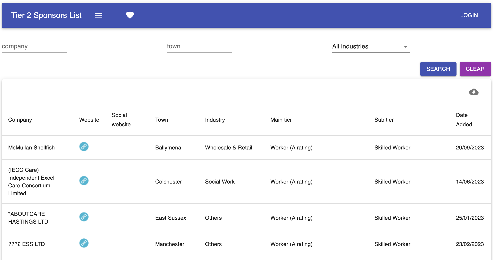
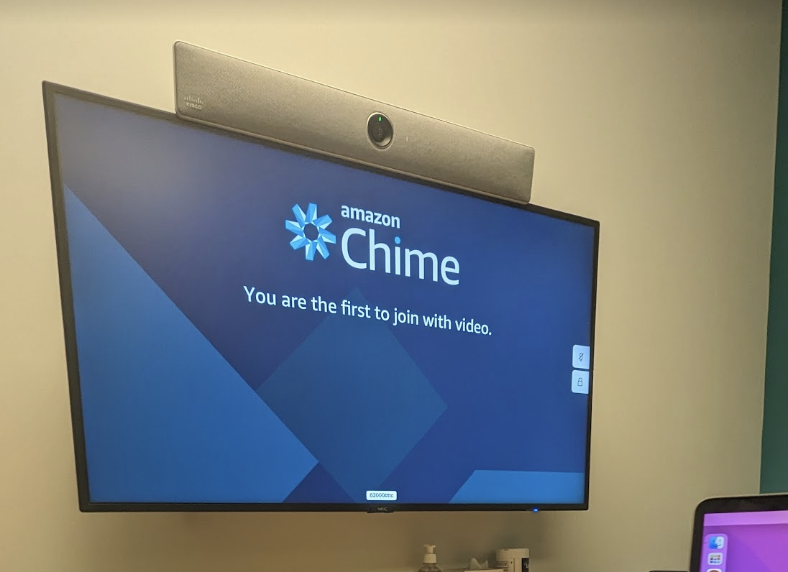
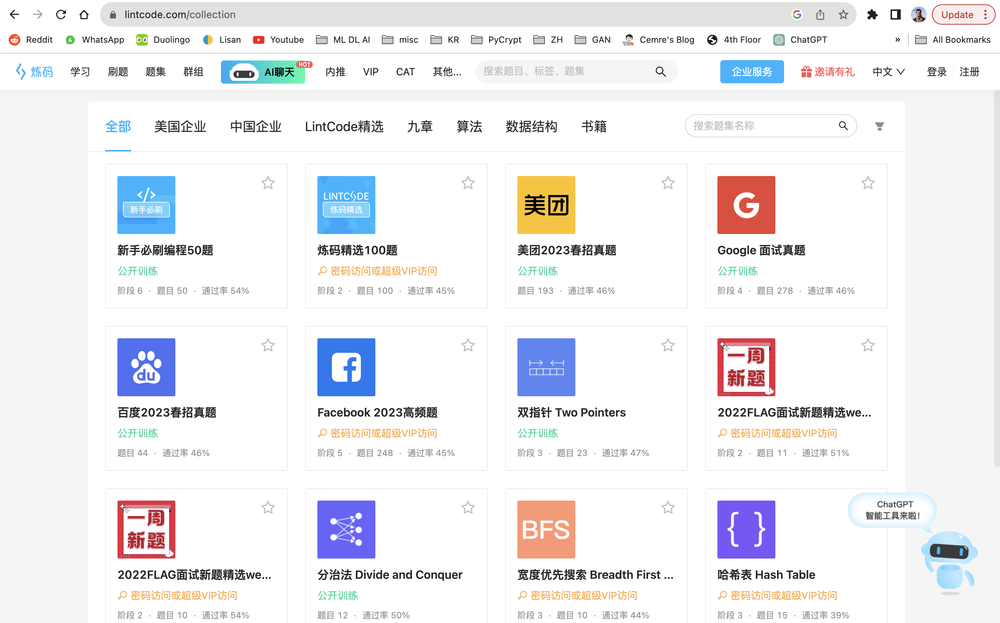
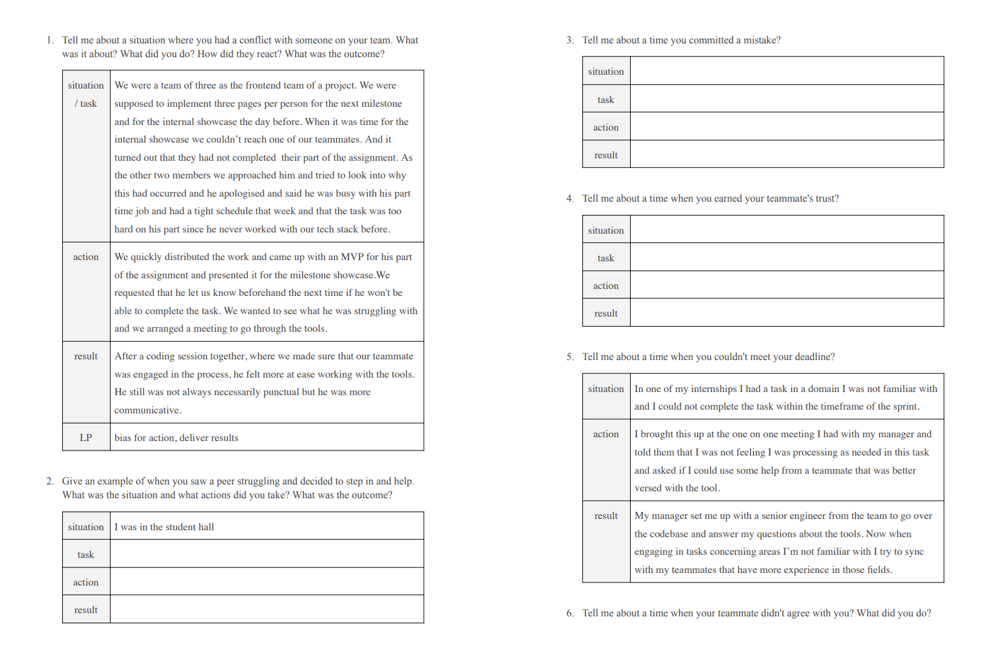
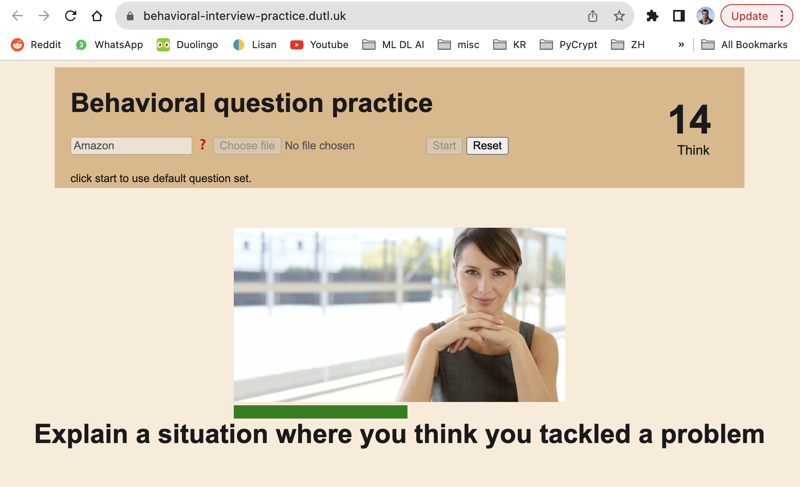

# İngiltere'de iş bulmak (bilgisayar mühendisleri için)

Üniversite'de son yılımda **Amazon Prime Video**'den iş teklifi alarak, mezun olduktan 3 ay sonra 2022 Mayıs'ta İngiltere'ye taşındım. İki yıl kadar orada çalıştıktan sonra geçtiğim Rippling şirketinde bilgisayar mühendisi olarak çalışmaya devam ediyorum.

Burada zaman geçirdikten ve yurtdışında çalışmak isteyen genç türklerle konuştuktan sonra bu sürecin çok fazla bilinmeyenlerle dolu olmasının bir çok kişiyi korkutup kaçırdığını fark ettim. Ben de süreci iki kez yaşamış birisi olarak Türkiye'den İngiltere'ye gelmek ve İngiltere'den çalışma izni almak isteyen isteyen bilgisayar mühendisleri için bir rehber oluşturması amacıyla bu yazıyı yazmaya karar verdim.

[TOC]

## 1. Ne nedir

- **Vize Sponsorluğu**: Vize sponsorluğu, bir şirketin, potansiyel bir elemanın İngiltere'de çalışma vizesi alma sürecine destek olmasına deniyor. İngiltere çalışma izni olmayan bir türk vatandaşının bu izni almasının <s>üç</s> iki yolu var (<s>Ankara antlaşması</s>, Skilled Worker (_Kalifiye Eleman_) Vizesi & Global Talent (_Uluslararası Yetenek_) Vizesi). _Skilled Worker_ vizesini almanız için bir şirketin size sponsor olması ve sizin vize masrafınızı karşılaması gerekiyor. Ayrıca şirketiniz size bir göç ajansı'nın desteğini saplayarak işinizi kolaylaştırabiliyor. _Global Talent_ vizesinde kendinizi sponsorlayabiliyorsunuz fakat bu vize türü çok daha az ve küresel ölçüde yeterliliğini kanıtlamış kişilere veriliyor (Bu vizeyi almış bir arkadaşımı ikna edebilirsem bu konuda bir post yazdırıp buraya ekleyeceğim).

- **Rolling Admission**: Rolling admission (_Sürekli işe alım_), bazı şirketler tarafından kullanılan bir işe alım yöntemidir. Pozisyonlar ilan edildikten sonra süreç her potansiyel işçi için ayrı ayrı işler. Yani önce herkesin özgeçmişleri toplanıp, herkesi eleyip, herkesi mülakata çağırıp adım adım ilerlemek gibi bir durum, rolling admission'da yoktur. Onun yerine, bir yarış gibi, ilk başvuranın özgeçmişi ilk incelenir. Daha sonra uygunluğunu en erkene veren çalışan ilk mülakata girer. Ve doldurulması gereken 5 pozisyon varsa, pozisyonların 5i de dolana kadar işe alım süreçleri devam eder. Bunun anlamı şirketler için tüm elemanlara bakıp en iyisini seçemeyecekler demektir. "Yeterince iyi" olanlar işe alınır. Adaylar içinse bu şu demektir: Ne kadar erken başvurursanız, şansınız o kadar yüksek.

## 2. Açık bir pozisyon bulmak

Recently, the job market hasn't really been the best. Finding job openings can be tiresome and locating job offers that do offer visa sponsorship is not easy as companies do not always include this in their job listings. Let me list what I tried and what I ended up doing.

Malesef tüm şirketler açtıkları iş ilanlarında vize sponsorluğu yapıp yapmadıklarını yazmıyorlar. Bunun çevresinden dolanmak için yaptığım bazı şeyleri aşağıda listeledim.

Açık pozisyonların nasıl bulunacağı konusuna derinlemesine girmeden önce, şirketlerin çoğunun **rolling admisson** ile işe alım yaptığını tekrar belirtmek istiyorum. Bu yüzden pozisyonlara **olabildiğince erken başvurmalısınız**. Bu gerçekten işe alınmanız için en öneml faktörlerden biri. En basitinden 1 haftadır duran ilanlara başvurmasanız da olur.

Bu sebeple özgeçmişiniz hep hazır ve güncel olsun, hep ulaşabileceğiniz bir yerde (drive) dursun. İlanları gördüğünüz anda başvurun.

Gelelim süreçte yaptıklarıma:

### 2.1 Linkedin 

**Profil Lokasyonu**

Öncelikle profil lokasyonunuzu İngiltere'ye hatta Londra'ya değiştirin. Bu yetenek avcılarının (_head-hunter_) aramalarında da çıkmanızı sağlayacaktır.

**Önerilenler**

Her 2-3 günde bir LinkedIn'e girip İngiltere'de bana önerilen pozisyonlara bakıyordum, algoritmaya bir miktar güvenebiliyoruz.

**Email alarmları**

Linkedin email alarmlarımı açtım. Fakat direkt Linkedin'in önerilen alarmlarını kabul ederseniz onların sonuçları fazla genel oluyor. Çok fazla işe yaramaz pozisyon gösterdiği için bir noktadan sonra can sıkıcı olmaya başlıyor. Ben bana uygun pozisyonları filtreleyerek bazı aramalar oluşturdum ve bu aramalara özel email alarmlarını aktifleştirdim. Bir kaç spesifik aramaya özel alarmlarım vardı (Genel yazılım vs. yapay zeka etc). Böylece yeni pozisyonlar çıktıkça haberim oluyordu.

Aramalarımızı detaylandırmak için kullanabileceğimiz girdilere bir bakalım:

1. 🟢 **Kelime sorgusu (Text Query)**: Bu, LinkedIn aramanıza başladığınızda ilk olarak aradığınız sorgudur. Benim alarm ayarlarımda `Software`, `Data Scientist`, `Machine Learning` gibi sorgular vardı. Bu alan sizin uzmanlığınıza bağlı olacaktır ancak çoğu ihtiyacı karşılamak için `Software` aramasını takip etmek mantıklı olur.
2. 🟢 **Yayınlanma Tarihi (Date Posted)**: Bunu, alarmınızın sıklığına uygun tutmak en iyisidir. Yani, günlük alarmlarınız varsa, son 24 saati dahil edin.
3. 🟢 **Lokasyon (Location)**: Bu, güvenli bir alandır ve genellikle şirketler tarafından doğru kullanılır. Benim aramalarımın neredeyse tamamı Birleşik Krallık ile sınırlıydı. Birkaç şehir, ülke veya ekonomik bölge (örn. Avrupa Birliği) belirleyebilirsiniz.
4. 🔴 **Deneyim Seviyesi (Experience Level)**: Bu, LinkedIn aramaları için **güvenli olmayan** bir alandır çünkü iş ilanlarını yayınlayan şirketler tarafından genellikle dikkate alınmaz ve/veya yanlış kullanılır. `Giriş Seviyesi` diye filtrelerseniz, birçok giriş seviyesi fırsatı kaçırabilirsiniz, bu yüzden bu alanı kullanmamanızı öneririm.
5. 🟠 **Şirket (Company)**: Bu alanı, daha spesifik bazı ek alarmlar tanımlamak için kullandım. FAANG'a yakın şirketler (Facebook, Apple, Amazon, Netflix, Google ve Twitter, JPMorgan, Bloomberg, Yelp, SkyScanner gibi) için 24 saatlik bir alarm ve şirket alanı boş bırakılmış haftalık bir alarmım vardı, böylece tüm açık pozisyonları takip edebiliyordum, ama vize sponsorluğu yapma ihtimali daha yüksek olan bu şirketlerden günlük haberim oluyordu.
6. 🔴 **Yerinde/Uzaktan (On-site/Remote)**: Bu alanın da hatalı kullanımına sıkça rastlandığı için kullanmamanızı öneririm.
7. 🔴 **Kolay Başvuru (Easy Apply)**: Kolay başvuru yaptığım ilanlardan bana geri dönüş yapan kimse olmadığından bu alanı kırmızı işaretledim. Eğer bir Kolay Başvuru ilanı görürseniz, şirketin resmi web sitesindeki işe alım sayfasını kontrol etmenizi öneririm. Kendi sitelerinde herhangi bir ilan yayınlamamışsa sadece o zaman Kolay Başvuru'yu kullanın. Aksi takdirde siteleri üzerinden başvurmayı önceliklendirin.
8. 🔴 **Sektör (Industry)**: Bu alanı filtrelemeyi önermiyorum çünkü farklı sektörlerdeki şirketler iyi maaşlı ve köklü yazılım mühendisi pozisyonları sunabilir. Bloomberg gibi. Yüksek maaşlı sektörlere (Finans gibi) odaklanıyorsanız, bu alanı kullanmak isteyebilirsiniz.
9. 🔴 **İş Unvanı (Job title)**: Bu alanı, alarmınız teknoloji sektörü şirketleriyle sınırlı değilse filtrelemenizi önermem.
10. 🔴 **Maaş (Salary)**: İşe alımcılar tarafından pek kullanılmayan ve sıkça boş bırakılan bir alan olduğu için bu alanı kullanmamanızı öneririm, aksi takdirde fırsatları kaçırabilirsiniz.

**Profil**

Demeye çok gerek yok sanırım ama  **profiliniz güncel olsun**. Geçmiş ve şimdiki pozisyonlarınızı güzelce detaylandırın, ve profilinizdeki kısa açıklamada en güçlü yanınızı belirtin ki işe alımcıların aramalarında yukarıda çıkasınız. İşe alımcıların attığı mesaj ve mailler spam gibi gelebilir, fakat aslında onlar çalıştıkları şirketlerde birilerini işe aldırdıkça para kazanan insanlar, o yüzden ellerindeki pozisyonlara uygun olduğunuz noktada size ulaşmalarını istemeniz yararlı olur.

### 2.2 Şirketlerin kendi siteleri

You must subscribe to **job opening alerts** by your target companies that are hiring at high volumes. This covers any big tech.

Fazlaca alım yaptığını ve/veya sponsorluk yaptığını bildiğiniz şirketlerin direkt sitesinden de yeni iş ilanlarını takip etmelisiniz. Unutulmamalı ki şirketler pozisyonlarını ilk kendi sitelerinde paylaşıyorlar.

Sıkça kontrol etmek isteyeceğiniz bazı siteler:

- [Meta kariyer](https://www.metacareers.com/)
- [Amazon jobs](https://www.amazon.jobs/en/)
- [Google kariyer](https://www.google.com/about/careers/applications/)

Çoğu şirketin iş ilanları için **email listeleri** oluyor, kesinlikle üye olmanızı tavsiye ederim.

### 2.3 Vize sponsorluğu yapabilen şirketleri nasıl buluruz

Tüm şirketler vize sponsorluğu yapmıyor. Vize sponsorluğu yapabilen şirketler de tüm pozisyonları için sponsorluk sağlamıyorlar.

What I did for applying to non-big-tech companies was using the following website to track visa sponsors:

Big-tech olmayan şirketlere başvuracağım zaman vize sponsorluk durumlarını anlamak için şu siteyi kullandım

Link: [UK Tier Sponsors](https://uktiersponsors.co.uk/). Eğer bu site bozuksa (bazen araması bozuluyor), şunu kullanabilirsiniz: https://uk-sponsors.dutl.uk.

Bu sitelerde vize sponsorluğu lisansı olan şirketlerin tamamını görebilirsiniz.

Bu siteleri iki şekilde kullandım:

1. LinkedIn'de ilanlarını bulduğum şirketlerin vize sponsorluğu lisansı olup olmadığını kontrol etmek için

2. Listedeki tüm şirketleri listeleyip teker teker LinkedIn'de açık pozisyonları olup olmadığına bakmak için

Not: İkinci seçeneği yapıyorsanız sektör filterelemesi yapmak veya 'Software' gibi anahtar kelimeler kullanmak zaman kaybınızı azaltabilir. 

Not: uktiersponsors kaydedilenler listesi, slack komünitesi, son eklenilenler gibi yeni özellikler eklemiş. Bunlar da baya kullanışlı olabilir, benim zamanımda yoktu.

### 2.4 Mutluluk paylaşmakla çoğalır

Alarmlar mail listeleri yararlı evet, ama ilanların bir insan filtresinden geçmesi çok daha iyi. Eğer birlikte bir şeyler yapmaya açıksanız ve sizinle birlikte bu yola baş koymuş dosltlarınız varsa; Mesajla konuşabileceğiniz gruplar kurun veya hazır bir gruba girin. Biz dönemden arkadaşlarla bir grup kurmuştuk ama biliyorum ki daha organize daha büyük topluluklar da var (tüm uygulamalarını doğru bulmasam da [Kesişen Yollar](https://kesisenyollar.org/) bunlardan başarılı bir tanesi).

### 2.5 Başvurmadan önce

**Referanslar**

Bir şirketin iş ilanına başvurmadan önce, iletişimde olduğunuz kişilere danışın. Eğer başvuracağınız şirkette daha önce birlikte çalıştığınız veya yazılım geliştirme ile ilgili etkinliklerde birlikte yer aldığınız bir kişiyi tanıyorsanız, pozisyona başvurmadan önce onlara ulaşın.

Çoğu şirketin, çalışanlarının birlikte çalıştıkları/tanıdıkları kişiler için referans olabildiği bir referans programı vardır. Ulaştığınız kişi, seçtiğiniz pozisyona başvurmanız için size bir referans bağlantısı gönderebilir. Bu, sizi mülakat sıralamasında daha üst sıralara yerleştirir ve işe alınma şansınızı artırabilir.

**ÖNEMLİ:** Çoğu şirketin, başvurunuzu gönderdikten sonra başvurunuza bir referans eklemenize izin vermediğini de unutmamak lazım. Bu yüzden **başvurmadan önce referansınızı aldığınızdan emin olun**.

## 3. İşe alım sürecinin adımları

İşe alım süreci genellikle şu adımlardan oluşur (2 ve 3 bazen yer değiştirebilir):

1. Online değerlendirme (_Online Assessment / OA_)
2. Kodlama mülakatı (_Phone Screen_)
3. İşe alımcıyla görüşme
4. Yerinde mülakat (_Onsite_)

### 3.1 Online değerlendirme

Genellikle mülakat sürecinin ilk adımı olan OA, genellikle sizin belirlediğiniz 45-60 dakikalık bir süre içinde çözebileceğiniz iki kodlama sorusundan oluşur.

Unutulmaması gereken önemli bir nokta, malesef bu sorularda 100/100 puan almanın bir sonraki adıma geçmeyi garanti etmeyeceğidir.

### 3.2 Phone-Screen Interview

In this step you solve your questions by demonstrating your thought process to an engineer, walking them through the process.

Reaching this step means you are officially going through the interview process. You have passed a CV-review and have demonstrated skill in solving coding problems. 

This is the first step you meet with an engineer from the company, and get to ask questions. Depending on the company you may get asked behaviorals questions. In which case refer to the STAR method.

### 3.3 Recruiter Call

You get a call from the recruiter, where they walk you through next steps. You may sometimes be asked small questions based on your skills for them to delegate you to one of the open positions with the title you've applied for.

### 3.4 On-site Interview

On-site interviews are traditionally done by inviting over the candidate to the office of the position. The candidate's accommodation and travel is reimbursed. There, they go through 3 to 5 interviews back to back. These are usually 45 minute phone screen style interviews with 15 minutes of breaks inbetween (or 55-5). I heard they make you write code on a whiteboard! Personally, I went through online on-sites as I was applying through Covid.

### 3.5 Additional notes

This process can slightly change depending on the company you are interviewing with. For example Palantir has a contractor firm that does their phone interviews for them. So you won't be meeting a Palantir engineer during your phone interview.

Another thing Palantir does differently is that the onsite is not the final step. There, you also go through a manager call (which I didn't progress to). Where the hiring manager decides if you're a good fit for them.

## 4. My Experience with the hiring process

Whilst I was going through the interviewing process, I wanted to keep track of everything and keep some statistics on how it was going. 
For this, I started keeping an excel sheet. I kept the _company name, position, level, application date, location, interview steps_ and a little progress bar for some pizazz.

I also keep notes to track what went well and what could be improved. Getting back to this info later and addressing improvement opportunities is extremely useful.

If you need a little estimate of what it took for me to land my job offer; I applied for 202 separate positions in 80 days. You can see a small summary of how my job hunt went in the numbers below.

{style="max-width: min(500px, 100%);"}

## 5. My experience getting hired by Amazon

Interestingly, out of the 202 positions I have applied to, the position I went forward with and received an offer from was through my first ever application.

I had applied to Amazon and interviewed with them 2 years prior for an internship role. My experience was **very positive**, but as it goes, I was underprepared and failed the phone screen interview. 

Then as I was looking for a job 2 years later, **Amazon was the first company I applied to**. I had applied for a non-student position. I **managed to progress** through the **OA**, the **phone screen interview** and the **recruiter call** so they had me pick a date for the onsite interview. When nobody was confirming the date I picked T minus 2 days, I reached out to everyone I could to find out that **the position I had applied for was already filled**, and the opening was to be closed.

Disheartened, I explained that as a senior year student I was able to pass through this interview process and that I believed this shows potential and skill. I explained that I would like my process to be counted towards a graduate role. I pushed for this and tried to add grease to the communication between recruiters and hiring managers by asking for updates as least intrusively as I could but still frequently. 

I was given the green light and was told to wait for a certain recruiter to reach out. A month later when student programs started receiving applications, I had my **onsite interview** over Amazon Chime and received **an offer within 5 days**.

I guess my lesson learned from this would be to not be afraid to **inquire about additional opportunities** even if you do get rejected. Asking can't hurt.

{style="max-width: min(500px, 100%);"}

The Amazon onsite is three back-to-back interviews for grad roles and 5 back-to-back interviews for non-grad roles. Every interviewer asks one behavioral question followed by a coding question or two. 

I can confidently say that Amazon's onsite was the onsite I found the most meaningful, due to the nature of the questions and how different they felt, from industry-standard leetcode questions. These were real business problems simplified into a 1-hour-ish problem, that didn't feel like neither an Introduction to Algorithms exam or a how-many-windows question.

After I joined the company I went through the hiring training as early as I could. When Amazon starts hiring, I will get to be on the other side of this process welcoming candidates and trying to give them their best interviewing experience :)

## 6. How to prepare for coding questions?

Not going to lie, coding questions aren't easy. There are some things you can do to get better at it.

### 6.1 Read some Cracking the Coding Interview

Might be a little bit old school, but I definitely suggest you start by reading `Cracking the Coding Interview` which I read in a nice little motel down in Şile before an interview. This should give you more than just how to solve questions. It gives very good pointers about how to create a good CV and a lot of other points as well.

I would suggest reading it selectively, skipping stuff you already know about.

### 6.2 Solving LeetCode problems

Go to [LeetCode](https://leetcode.com) and create an account if you haven't done so.

I am not one to give advice on this part probably, because my methodology was extremely painful. I would try to solve 2 questions a day, without consulting outside sources. It would take me between 20 minutes to 2 hours to solve one question. So. I spent 40 minutes to several hours every day. 

Instead what I should have done was applying my battle-tested study technique that I used when preparing for national placement exams, adapted to this new domain.

**The technique**

Solve three questions a day. **Do not spend more than 10 minutes without progress**. If you can't progress, read solutions until you understand one fully and save the link to the question into a document with a date (call this the unsolved doc).

Next week, every day pick up one to three (depending on how long your list is) questions to solve from your unsolved doc. The ones you can solve, put them into a new document (call this the solved doc).

If you can't solve a question in your unsolved doc, add the number 1 next to the question. Read solutions, rinse & repeat.

If you are getting high numbers next to some questions, watch videos on them, re-implement solutions by reading, whatever helps it to stick. 

Every now and then, may be every month, go through your solved list. Try to see the solution to every question in your mind. If you can't, solve it again. If you can't, add it back to your unsolved list.

This ensures indefinite repetition of questions you can't solve and exerts less focus on the ones you can.

### 6.3 Finding company-specific questions

Leetcode has question sets curated for interviewing at certain companies. However these lists are behind a paywall. I cam across lots of people who recommended I paid for a subscription to access these lists. You may want to do that if you have a bunch of money lying around. I chose to go a different way.

**Enter Lintcode Collections**

**LintCode** is basically a Chinese **LeetCode clone**. You don't need to create an account although it helps get rid of annoying prompts.

LintCode collections have separate **collections of questions in the style of specific companies**. I used LintCode collections when interviewing with Twitter and Facebook. If you know a bit of Mandarin you can go a long way on LintCode. If not, you can use any translation extension to explore questions. 

Mind you, these are not special questions you can't find anywhere, but questions _lists_ curated for companies. If you want to better keep track of your progress, you can look through the lists, then find and solve the question on LeetCode. That is what I did, primarily because at the time LintCode did not support community solutions, whereas LeetCode did.

## 7. How to prepare for behavioral questions?

Behavioral questions are questions where the interviewer asks the interviewee questions regarding how they behaved in certain scenarios in the workplace. If you're a student and have no work experience, you can resort to finding examples from group projects.

### 7.1 The STAR method

On how to answer these questions: just go ahead and search for the STAR method. This is the industry standard for answering behavioral questions. In a nutshell you can use STAR to tell a story by laying out the Situation, Task, Action, and Result. 

- **Situation**: Set the scene and give the necessary details of your example.
- **Task**: Describe what your responsibility was in that situation.
- **Action**: Explain exactly what steps you took to address it.
- **Result**: Share what outcomes your actions achieved.

It is best not to try and form these stories on the whim. It really does take a few interviews to get how to do this right. 

### 7.2 Leadership principles

I really do suggest going and having a read on **Amazon's LPs**. They are good **tenets** on which you can build your work ethics. LPs are actually applicable industry-wide and it is good to have stories matching Amazon's LPs even if you're interviewing somewhere else.

The 16 current leadership principles are in no particular order:

1. Customer Obsession
2. Ownership
3. Invent and Simplify
4. Are Right, A Lot
5. Learn and Be Curious
6. Hire and Develop the Best
7. Insist on the Highest Standards
8. Think Big
9. Bias for Action
10. Frugality
11. Earn Trust
12. Dive Deep
13. Have Backbone; Disagree and Commit
14. Deliver Results
15. Strive to be Earth’s Best Employer
16. Success and Scale Bring Broad Responsibility

I suggest going and having a read of [Amazon's Leadership Principles](https://www.amazon.jobs/content/en/our-workplace/leadership-principles) in greater detail.

### 7.3 How to prepare your answers

During my interviewing process, I curated a list of behavioral questions from a bunch of companies. I added stories from my experience in the STAR method to some key questions. For others, a story from another question could be reused. I left these blank. I matched these question-story pairs with related Leadership Principles (LPs). See below some example pages from the document I kept;

I had also created a small tool to practice interview questions. This tool has a default set of questions that it displays on the screen. You have 30 seconds to think about each question, and 90 seconds to recite your answer. The tool takes no input, only provides you questions and a timer.

Here's a link to the rather 00s looking tool: [Behavioral Interview Practice](https://behavioral-interview-practice.dutl.uk)

## 8. How to get better at interviewing

> A tourist asked a New Yorker how do you get to Carnegie Hall. And the answer was: Practice! Practice! Practice!

It goes without saying that you should practice the whole interviewing process. For this you should get interviewed.
As you go through interviews at companies, you will get more practice. You should take notes after every interview on what went well and what could be improved.

However, you might not get a lot of interviews and not want to spend first few interviews making errors, or, you might want to get mock interviews.

**Mock interviews**

In my case, as I applied to a whole lot of companies I got to interview at a lot of places. In the meantime, me and my friends who were also looking for a job (and ones who did find oen) at the time had a WhatsApp group. Prior to interviews or interview seasons we would write and ask if someone could mock-interview us.

Other people would join in to shadow as well. So you would be interviewing with a friend or acquaintance, in English, with a bunch of others watching. It closely replicates the _Stage fright_ aspect of the interviewing process. Which helps calm you down in consecutive interviews.

If you don't have (such) friends, you can check out peer mock interview services. These are web apps that match two people who want to practice the two sides of the interviewing process. Examples TBA.

## 9. Conclusion

This sums up the tools and techniques I have used to secure a Software Engineering position in the UK as a Turkish citizen. This is not meant to be a definitive guide, but offers perspective from someone who has been through the process in a rather short time. I hope having read this, you have learned a thing or two you did not know about or gained a realistic perspective on what it takes to conclude a job hunt.

Mind you, this document has no mention of the Global Talent or Global Promise visa schemes, which completely remove the need for finding a company that can sponsor your visa. I have friends going through this process. I am trying to get them to write up a small document describing that process as well. If I succeed, I'll add a link to their post here.

If you would like to ask any follow-up questions, reach out to me using my [contact](/contact) page.

! include socials

! include other-articles
