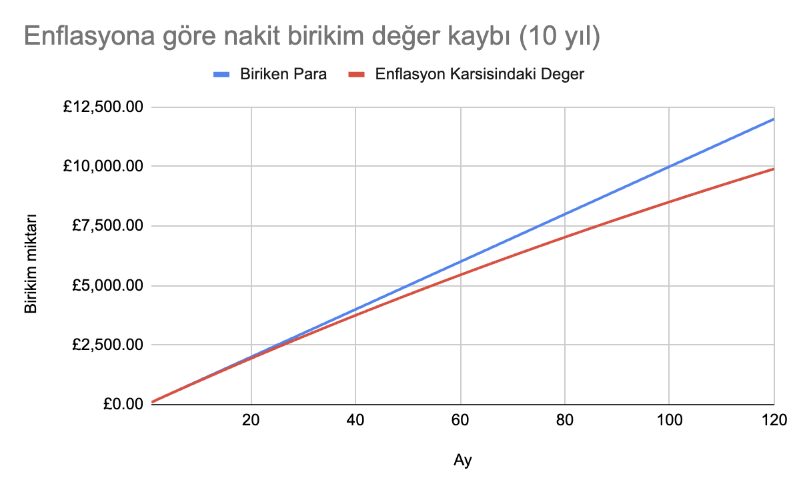

# İngiltere'de vergisiz yatırım: ISA nedir?

Bu yazıda İngiltere'de ikamet edenler için kolay ve vergisiz yatırım sağlayan ISA'lerin ne olduğunu, neden kârlı olduğunu ve nasıl açılacağını açıklıyorum.

[TOC]

## Neden yatırım yapmalısınız

Türkiye'de büyürken çevremdeki yatırım şekilleri şunlardı: Parayı bankada biriktirmek, altın almak, döviz almak. Kendim de arttırdığım bütün parayla döviz alıyordum, çünkü para TL'de tutulursa enflasyon oldukça eşit oranda değer kaybediyodu, döviz ise TL'ye göre hep artıştaydı (faizlerin %14lerde gezdiği zamanlar).

İngiltere'de yaşamaya başlayınca insanın eline geçen para zaten döviz oluyor, işte o zaman paranın durduğu yerde eridiği tekrar belli oluyor. Sterlinde de enflasyon var, dolarda da. Özellikle de birikim yapmaya çalışıyorsanız. (Altın farkli bir konu).

2022-23'deki kriz zamanını yok saysak bile, İngiltere'de enflasyon bu aralar %4 civarında. Basit bir hesapla 10 yıl boyunca maaşınızdan £100 biriktirdiğinizi varsayalım. 

5 yıl sonunda kenarda biriktirdğiniz paranın değerinin %10unu kaybettiğini görebilirsiniz.

| **Yıl** | **Ay** | **Biriken Para** | **Enflasyon Karşısındaki Değer** | **Enflasyona Kaybedilen Yüzde** |
|---------|--------|------------------|----------------------------------|---------------------|
| 0       | 1      | £100              | £100                              | 0.00%               |
| 0       | 2      | £200              | £199.67                           | 0.17%               |
| 1       | 12     | £1200             | £1178.24                          | 1.81%               |
| 2       | 24     | £2400             | £2310.21                          | 3.74%               |
| 3       | 36     | £3600             | £3397.72                          | 5.62%               |
| 4       | 48     | £4800             | £4442.52                          | 7.45%               |
| 5       | 60     | £6000             | £5446.28                          | 9.23%               |

[tam tablo](https://docs.google.com/spreadsheets/d/1m7qbAlTDD7CuxjMsYBVIIGdn7fneR_Hbj3ccn3QwnXo/edit?usp=sharing)

{style="max-width:80%"}

Buradan çıkaracağımız ders: Enflasyonu yenmemiz lazım. Ama nasıl? Tabii ki enflasyonla değeri düşmeyen varlıklara yatırım yaparak. Enflasyon tanım itibariyle paranın değer kaybetmesi demek. Yani yüksek enflasyon olduğunda değer kaybeden başlıca (ve bazen yegane) varlık paradır. Örneğin gayrimenkul fiyatları enflasyona yenik düşmez. Aynı şekilde, şirketlerin reel değeri de (sadece enflasyon sebebiyle) düşmez. O zaman bize düşen yatırımlarımızı gayrimenkul veya şirketlere yönlendirmek. Gayrimenkul alacak paramız yok, fakat neyse ki şirketlerin bütününü satın almamız gerekmiyor. İşte burada hisseler devreye giriyor.
 
Borsanın avantajı ev ve arsa gibi yüzbinlerce sterline sahip olmadan da giriş yapabilmeniz. Daha büyük varlıklar alacak paranız yoksa ve alabilecek olana kadar paranız değer kaybetmesin istiyorsanız borsa güzel bir seçenek.

## ISA nedir?

ISA (Individual Savings Account), İngiltere'de şahısların **vergi avantajları**ndan yararlanarak birikim ve yatırım yapmalarına olanak tanıyan bir hesap türüdür. ISA heaplarınızda **nakit** tutabilir, **hisse** satın alabilirsiniz. ISA'lerin diğer hesaplara göre avantajı ise yıllık 20 bin pound'a kadar olan anaparanızla kazandığınız herhangi bir borsa kazancından vergi almamasıdır.

## ISA ile ne kadar vergi avantajı sağlayabilirim?

Normal şartlar altında İngiltere'de £100 değerinde $AMZN (Amazon hissesi) alırsanız, ve vergi yılının sonunda bu hissenin değeri £110'a çıkarsa, aradaki £10 kazancınızdan anapara kazanç vergisi ([capital gains tax](https://www.gov.uk/capital-gains-tax/)) ödemeniz gerekiyor. Anapara kazanç vergisi oranınız toplam gelirlerinizin vergi dilimine göre değişecektir:

| Kazanç Aralığı          | Vergi Oranı  |
|-------------------------|--------------|
| 12.500 GBP'ye kadar     | %0           |
| 12.501 - 50.000 GBP     | %20 (basic)  |
| 50.001 - 150.000 GBP    | %40 (higher) |
| 150.000 GBP üzeri       | %45 (higher) |

Vergi diliminiz _higher_ ise hisse senetlerinizdeki değer artışından ([chargeable asset](https://www.gov.uk/capital-gains-tax/what-you-pay-it-on) kategorisinden) %20 vergi ödüyorsunuz. Eğer _basic_ ise daha karışık (ve yüksek). Adım adım hesaplanmasına [şuradan](https://www.gov.uk/capital-gains-tax/rates#if-you-pay-basic-rate-income-tax) bakabilirsiniz.

Bu da demek ki örneğin yıllık £51,000 brüt geliriniz varsa, normal yatırım hesaplarından elde ettiğiniz borsa kazançlarınızın %20'sini vergi olarak Majestelerinin Gelir İdaresi'ne vereceksiniz.

Öte yandan ISA hesapları, kazançlardan vergi alınmaması gibi önemli bir avantaj sunuyor. Açtığınız ISA hesabına yıllık 20 bin poundu aşmayan anaparanızı koyduğunuzda istediğiniz gibi borsa kaplanıcılık oynayabilir, elde ettiğiniz kazanç üzerinden ise hiç vergi vermezsiniz.

## Kimler ISA açabilir?

ISA açabilmek için İngiltere'de ikamet ediyor olmanız gerekiyor. Ayrıca Amerikan vatandaşları ISA'lerden yararlanamıyor.

## ISA güvenli midir?

ISA'lere yatırdığınız para (Anapara) FSCS koruması altında olduğu için ISA bankanızın batması halinde, devlet size paranızın tutulduğu banka başına 85 bın pounda kadar olan anaparanızı geri ödemek zorundadır. Detaylar için https://www.fscs.org.uk/'e bakabilirsiniz.

## ISA türleri nelerdir?

ISA'lerin dört ana türü bulunmaktadır:

- **Cash ISA**: Nakit bazlı birikim hesabıdır. Paranıza faiz verir, faizden gelir vergisi ödemezsiniz.
- **Stocks and Shares ISA**: Hisse senetleri (stock), yatırım fonları (fund) gibi çeşitli yatırım araçlarını içeren bir hesap türüdür. Elde edilen kazançlar ve temettü (dividend) vergiye tabi değildir. Bu hesapların geneli de attığınız nakite **CISA** gibi faiz verir.
- **Lifetime ISA (LISA)**: 18-40 yaş arası bireyler için tasarlanmıştır. Ev almak ve emeklilik için birikim yapmayı teşvik eder. Devlet, koyduğunuz paraya %25 katkı ekler. (yıllık maksimum 4,000 GBP koyabilirsiniz). Bu şekilde LISA ile devletten her yıl £1000 destek alabilirsiniz _fakat_ LISA'dan paranızı çekebilmeniz için ya (1) 60 yaşına gelmeniz ya da (2) <s>£400.000'dan</s> £450.000'den daha düşük değerli bir ev satın almak için parayı kullanmanız gerekmektedir.
- **Innovative Finance ISA**: Peer-to-peer lending (Bir-nevi DIY kredi bankacılığı) platformlarına yatırım yapmayı sağlar. Burada elde edilen faiz gelirleri de vergiden muaf tutulur. Şahsen ben bulaşmazdım.

Editörün tercihi burada **Stocks and Shares ISA** oluyor. Hem paranıza faiz alıp hem de paranızı enflasyona karşı dayanıklı fonlarda tutarak kazanç elde edebilirsiniz.

Ekleme - 2024: Bu yıldan itibaren aynı yıl içinde birden fazla ISA açmak artık serbert. Ayrıca, LISA ev fiyatı [şurada](https://assets.publishing.service.gov.uk/media/5a7f1183e5274a2e8ab49e9c/Lifetime_ISA_technical_note_September_2016_update.pdf) belirtildiği üzere £450.000'a çıkarıldı. Eğer Londra'da ucuz yollu bir 1+1 veya Londra dışından ev alma düşünceniz varsa, bir S&S ISA bir LISA açıp, ilk 4000 poundunuzu LISA'ya yatırmak kalanınıysa S&S ISA'e yatırabilirsiniz. Ev alacağınız zaman LISA'daki paranızı yılda 1000 poundluk devlet katkısıyla birlikte çekebilirsiniz. Yatırdığınız hisselerin yılda %25 artmasının düşük bir ihtimal olduğunu düşünürsek kârınızı maksimize etmek için güzel bir yol.

## ISA sağlayıcıları

İngiltere'de herhangi bir High St. bank'te hesabınız varsa bankanızın ISA yönetim hesabı hizmeti olması muhtemel. Fakat bankaların ISA hizmetleri genelde kullanması zor ve hantal kalıyor.

Aslında piyasada [sonsuz](https://www.gov.uk/government/publications/list-of-individual-savings-account-isa-managers-approved-by-hmrc/registered-individual-savings-account-isa-managers) ISA sağlayıcısı olsa da, ben bu yazımda dostlarımın ve kendimin tecrübesi olan, daha popüler ISA sağlayıcılarından bahsedeceğim:

- Vanguard
- Freetrade
- Trading212

### Vanguard

Vanguard ISA sağlayıcıların en eski ve köklülerinden. 
- İyi yanları: Fon yelpazesi geniş, yatırım yapma maliyeti düşük. 
- Kötü yanları: Mobil uygulaması yok, otomatik olmayan satın almalarınız ve hisselerinizi takip etmek için web sitesine giriş yapmanız gerekiyor. Tuttuğunuz fonlardan işletme komisyonu alıyor.

### Freetrade 

Freetrade daha modern ve kullanması kolay bir kullanıcı arayüzü sunuyor. 
- İyi yanları: Satış ve satın alımlarınızdan komisyon almıyor. 
- Kötü yanları: Aylık £5 üyelik ücreti.

### Trading 212

Yine modern arayüzlü bir uygulama. 
- İyi yanları: Freetrade'de olmayan bazı fonlara sahip, ama onun aksine aylık üyelik ücreti yok. **Pie** konseptiyle otomatik yatırım ve sepet oluşturmayı kolaylaştırıyor. Nakite verdiği faiz Vanguard'ın 2 katı (%5.6). 
- Kötü yanları: Freetrade'e kıyasla kullanımı başta biraz karışık gelebilir.

Editörün seçimi: **Trading 212**. Hem komisyonsuz al sat sağlıyor, hem de döviz makasları Freetrade'e göre daha dar (%0.45 vs %0.15). Aylık ekstra ücreti yok ve nakite verdiği faiz daha yüksek. Bir yıl boyunca Freetrade kullandıktan sonra bu yıl da Trading212 hesabı açtım ve şimdilik gayet memnunum.

## ISA sağlayıcılarında referans sistemiyle bedava hisse

Piyasada çok fazla ISA sağlayıcısı olduğu için ISA sağlayıcılarının çoğu referans sistemiyle yeni kullanıcılar çekmeye çalışıyor. Var olan bir kullanıcının referansıyla üye olduğunuzda hem referans olan hem de referans olunan kişiye bedava bir hisse veriyorlar. **Freetrade** kaydolanlara değeri **£10 ila £100** arasında değişen rastgele bir hisse veriyor. **Trading212** ise herhangi bir hisseden **£12** değerinde bir fraction veriyor.

## ISA hesabı açmadan önce bilmeniz gerekenler

1. ISA hesabınıza bir vergi yılında 20 bin sterline kadar anapara koymalısınız. Bu miktarı aşarsanız kazancınız vergiye tabi olacaktır.
2. <s>Her vergi yılında (Nisan - Nisan) bir adet ISA sağlayıcısında hesap açabilirsiniz.</s> 2024-25 Vergi yılından itibaren bu zorunluluk kalktı. İstediğiniz kadar ISA sağlayıcısınd™a hesap açabilirsiniz. Fakat her vergi yılında yatırdığınız toplam anaparanın 20 bin sterlini geçmemesi lazım.

## Nasıl ISA hesabı açabilirim?

ISA hesabınızı 15dk gibi kısa bir sürede açabilirsiniz. ISA sağlayıcılarına üye olurken bir tür fotoğraflı kimlik bulundurmanız iyi olur zira kimliğinizi doğrulamak için fotoğraflı kimliğinizin arkalı önlü fotoğrafını ve kendi yüzünüzün gözüktüğü bir selfie çekmeniz gerekecek. Hangi ISA sağlayıcısında hesap açmaya karar verdiğinize göre uygulamasını indirip üyelik işlemlerinizi başlatabilirsiniz.

Eğer buraya kadar okuduysanız ve referansla hediye hisse sisteminden faydalanmak isterseniz benim referans linklerimden üye olabilirseniz çok makbule geçer.

### [Trading 212 referans linki](https://www.trading212.com/invite/19BZWthpGq)
### [Freetrade referans linki](https://magic.freetrade.io/join/cemre-efe/552eee0e)

Bir başka yazımda da hangi fonlara ve hisselere ne şekilde yatırım yaptığımdan bahsedeceğim. Eğer takipte kalmak isterseniz cemre@duck.com adresine `+` başlıklı bir mail atmanız yeterli.

İyi biriktirmeler.

YTD :-)

! include socials
! include other-articles
